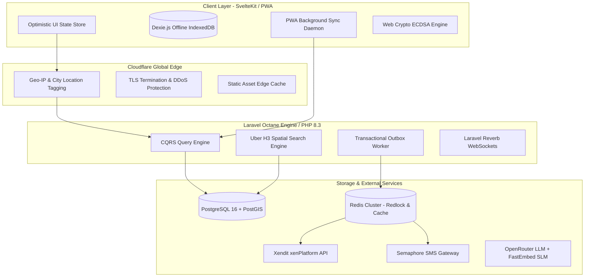
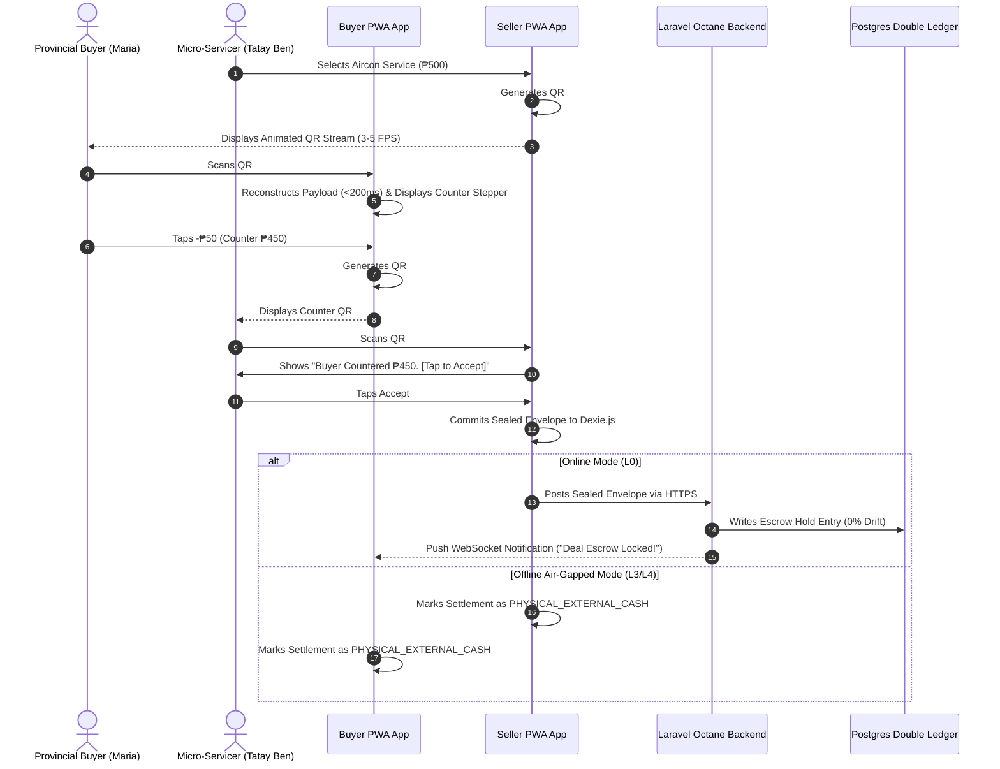
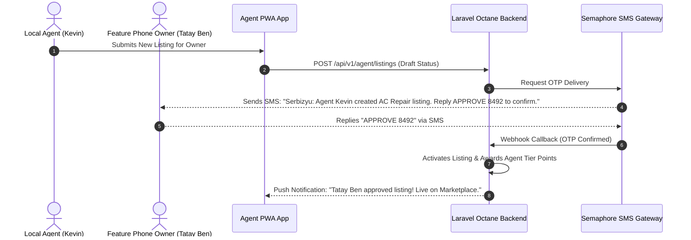

# Serbizyu 2.0 — System Architecture Spine & Technical Specification

> **BMAD Method Phase 3 Artifact: Architecture Spine**  
> *Document Version:* 3.1.0 (Full BMad Ceremony Edition)  
> *Date:* July 25, 2026  
> *Authors:* Winston (System Architect persona) & Engineering Lead  
> *Target System:* Serbizyu 2.0 Production & Pilot Infrastructure  

---

## 1. Executive Architecture Topology

Serbizyu 2.0 scales statelessly over a monolithic application core while retaining extreme low-bandwidth and offline resilience across provincial municipalities.



---

## 2. Entity Relationship Diagram (ERD)

The complete PostgreSQL 16 database design detailing all core entities, relationships, foreign keys, cardinality, and spatial types:

```mermaid
erDiagram
    USERS ||--o{ SERVICERS : "owns/operates"
    USERS ||--o{ AGENT_PROFILES : "manages"
    USERS ||--o{ BOOKINGS : "places as buyer"
    USERS ||--o{ WALLETS : "owns"
    
    SERVICERS ||--o{ LISTINGS : "offers"
    SERVICERS ||--o{ SERVICER_BIDS : "submits"
    SERVICERS ||--o{ BOOKINGS : "fulfills"
    
    AGENT_PROFILES ||--o{ SERVICERS : "onboards/manages"
    AGENT_PROFILES ||--o{ AGENT_COMMISSIONS : "earns"
    
    BUYER_REQUESTS ||--o{ SERVICER_BIDS : "receives"
    BUYER_REQUESTS ||--o| BOOKINGS : "converts to"
    
    LISTINGS ||--o{ BOOKINGS : "booked in"
    
    BOOKINGS ||--o{ LEDGER_ENTRIES : "generates"
    BOOKINGS ||--o{ DISPUTES : "subject to"
    BOOKINGS ||--o| BUDGET_TREE_NODES : "chained under"
    
    BUDGET_TREE_NODES ||--o{ BUDGET_TREE_NODES : "spawns child node"
    BUDGET_TREE_NODES ||--o{ LEDGER_ENTRIES : "tracks settlement"
    
    WALLETS ||--o{ LEDGER_ENTRIES : "holds balance entries"

    USERS {
        uuid id PK
        string phone UNIQUE
        string role "BUYER | SERVICER | AGENT | KIOSK | ADMIN"
        string verification_status "LANE_1 | LANE_2 | LANE_3"
        timestamp created_at
    }

    SERVICERS {
        uuid id PK
        uuid user_id FK
        bigint h3_index "Uber H3 Resolution 8 Cell"
        geometry location "Point SRID 4326"
        int verification_tier "1 to 3"
        decimal bayesian_rating
        int completed_jobs
        boolean is_active
    }

    AGENT_PROFILES {
        uuid id PK
        uuid user_id FK
        string agent_tier "BRONZE | SILVER | GOLD | PLATINUM"
        decimal commission_rate
        int active_managed_owners
        decimal graduation_bonus_accumulated
    }

    LISTINGS {
        uuid id PK
        uuid servicer_id FK
        int category_id
        string title
        decimal price
        string pricing_mode "FIXED | TIERED | HOURLY"
        jsonb attributes
        boolean is_active
    }

    BUYER_REQUESTS {
        uuid id PK
        uuid buyer_id FK
        int category_id
        string title
        decimal budget_max
        bigint h3_index
        string status "OPEN | AWARDED | EXPIRED"
    }

    SERVICER_BIDS {
        uuid id PK
        uuid request_id FK
        uuid servicer_id FK
        decimal bid_amount
        string proposal_text
        string status "PENDING | ACCEPTED | REJECTED"
    }

    BOOKINGS {
        uuid id PK
        uuid buyer_id FK
        uuid servicer_id FK
        uuid listing_id FK
        decimal total_amount
        decimal escrow_amount
        string status "CREATED | HELD_IN_ESCROW | COMPLETED | DISBURSED | DISPUTED"
        timestamp auto_release_at
    }

    BUDGET_TREE_NODES {
        uuid node_id PK
        uuid tree_id
        string parent_node_hash
        string node_type "VERTICAL_CHILD | HORIZONTAL_PEER"
        string settlement_mode "EXTERNAL_CASH | DIGITAL_ESCROW"
        uuid root_buyer_id FK
        uuid issuer_id FK
        uuid counterparty_id FK
        decimal authorized_budget
        decimal transaction_amount
        string nonce UNIQUE
        string state
    }

    LEDGER_ENTRIES {
        bigint id PK
        uuid wallet_id FK
        uuid booking_id FK
        uuid tree_node_id FK
        decimal amount "Credit + / Debit -"
        string entry_type "ESCROW_HOLD | SERVICER_PAYOUT | COMMISSION_FEE"
        string reference_code UNIQUE
    }

    DISPUTES {
        uuid id PK
        uuid booking_id FK
        uuid opened_by_user_id FK
        string dispute_reason
        jsonb evidence_logs
        string status "OPEN | RESOLVED_REFUND | RESOLVED_PAYOUT | RESOLVED_SPLIT"
        timestamp sla_due_at
    }
```

---

## 3. Core System Interaction Sequence Diagrams

### 3.1 Face-to-Face Quick Deal Optical QR Stream Sequence



### 3.2 Delegated Agent SMS Consent Sequence



---

## 4. Technology Stack Rationale

| System Layer | Technology | Decision Rationale |
|---|---|---|
| **Backend Core** | Laravel 12 / PHP 8.3 (Octane) | Proven developer velocity, built-in queue system, robust database ORM, low RAM footprint on self-hosted VPS. |
| **Frontend Framework** | SvelteKit / Inertia.js (TypeScript) | Zero-API glue boilerplate, instant client state reactivity, sub-20KB JS bundle footprint critical for low-data provincial connections. |
| **Database** | PostgreSQL 16 + PostGIS | Native spatial indexing (`ST_DWithin`, GIST), JSONB GIN indexing for flexible attributes, partial indexing for active queues. |
| **Caching & Locking** | Redis (Redlock) | Atomic cart slot reservations (15-min TTL lock), prompt caching, session persistence. |
| **Realtime Messaging** | Laravel Reverb | Self-hosted WebSockets compatible with Pusher protocol; zero third-party SaaS per-connection fee. |
| **Search Engine** | Meilisearch | Lightweight, self-hosted typo-tolerant search engine optimized for local dialect service names (*"mabaho aircon"*). |
| **Payment Gateway** | Xendit (xenPlatform API) | Sub-accounts and automated split rules for marketplace payouts; insulates platform under BSP-licensed custody. |
| **SMS Gateway** | Semaphore API | Native Philippine cellular carrier delivery (Globe/Smart/DITO) for Crockford OTP confirmation tokens (`ACCEPT X7K3`). |
| **Hybrid AI** | On-Device FastEmbed + OpenRouter | Tier 1 SQL rules ($0) $\rightarrow$ Tier 2 local FastEmbed SLM ($0 API) $\rightarrow$ Tier 3 OpenRouter LLM with 24h Redis prompt caching. |

---

## 5. Architectural Decision Records (ADRs)

### ADR-001: PostgreSQL 16 + PostGIS over MySQL 8
* **Status:** Approved
* **Context:** Need native geospatial indexing for barangay cells and flexible JSONB attribute querying.
* **Decision:** Choose PostgreSQL 16 with PostGIS extension.
* **Consequences:** Provides native $O(1)$ spatial queries and partial GIN indexing.

### ADR-002: Transactional Outbox Pattern over Direct Queue Dispatch
* **Status:** Approved
* **Context:** Network drops during booking transactions could desynchronize PostgreSQL database state from Redis queue workers.
* **Decision:** Write events to an `outbox_events` table within the same ACID database transaction, then poll outbox via background supervisor daemon.
* **Consequences:** 100% event consistency guarantee.

---

## 6. Phase 1 Cloud Hosting & Monthly Cost Model

Single-town pilot (Tagudin / Candon, ~30 servicers, ~50 bookings/week):

| Component | Provider / Strategy | Monthly Cost |
|---|---|---|
| **VPS Node** | Laravel Forge + DigitalOcean (4GB RAM / 2 vCPU) | $24.00 / mo |
| **Database & Cache** | Self-hosted Postgres 16 + Redis + Meilisearch on DO box | $0.00 (included) |
| **Map Services** | Mapbox GL JS (Free tier: 50k map loads / 100k geocoding) | $0.00 / mo |
| **Payment Gateway** | Xendit (Per-transaction processing ~1.5–3% + ₱11) | $0.00 fixed / mo |
| **SMS Gateway** | Semaphore API (~1,000 OTPs / month) | ~$22.00 – $45.00 / mo |
| **AI Assist** | OpenRouter proxy with 24h Redis prompt cache | ~$20.00 – $50.00 / mo |
| **Domain & SSL** | Registrar + Let's Encrypt | ~$1.50 / mo |
| **Total Pilot Run Cost** | | **~$70 – $145 / mo** (₱4,000 – ₱8,200) |

---
*End of Phase 3 System Architecture Spine.*
