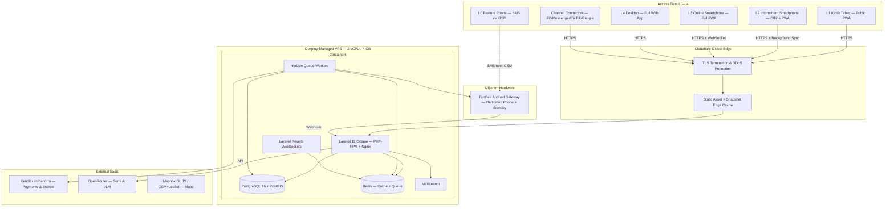
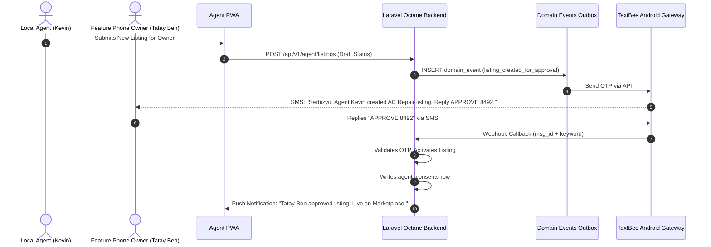

# Serbizyu 2.0 — System Architecture Spine & Technical Specification

> **BMAD Method Phase 3 Artifact: Architecture Spine**  
> *Document Version:* 3.2.0 (Reconciled with ADR Catalog v4.0.0)  
> *Date:* July 29, 2026  
> *Authors:* Winston (System Architect persona) & Engineering Lead  
> *Target System:* Serbizyu 2.0 Production & Pilot Infrastructure  
> *Supersedes:* architecture.md v3.1.0 (July 25, 2026) — stack, SMS, hosting, and schema all updated
> *Read with:* `adr-catalog.md` (v4.0.0, 21 load-bearing decisions), `serbizyu-schema-decisions.md` (30 tables, 8 bounded contexts)

---

## 1. Executive Architecture Topology

Serbizyu 2.0 runs as a monolithic Laravel application on a single Dokploy-managed VPS, serving every access tier (L0 SMS through L4 desktop) from one deployment. The PWA handles offline-first operation for L2–L4; the SMS layer (TextBee Android gateway) bridges L0 feature-phone users. Cloudflare provides the edge (TLS, CDN, DDoS).



**Trust boundary:** Everything inside "Dokploy VPS" is the private zone. TextBee, Cloudflare, Xendit, OpenRouter, and Mapbox are untrusted external surfaces. All internal container communication stays within the Docker network.

---

## 2. Database Schema

The schema was redesigned on July 28, 2026 (post-v3.1.0). The old ERD (SERVICERS/BOOKINGS/WALLETS/BUDGET_TREE_NODES) is **superseded**.

**Current design:** 30 tables across 8 bounded contexts. See `serbizyu-schema-decisions.md` for the full inventory.

| # | Domain | Tables |
|---|---|---|
| 1 | Identity & Access | users, auth_otps, devices, verification_documents, lane_progressions |
| 2 | Agent Network | agent_profiles, agent_assignments, agent_consents |
| 3 | Catalog | categories, listings, listing_media, availability_slots |
| 4 | Transactions | bids, deal_chains, orders, order_status_transitions, quick_deals, work_instances, work_proofs |
| 5 | Financial | ledger_accounts, ledger_entries, ledger_lines, payments, cash_receipts, payouts, commission_configs |
| 6 | Trust | disputes, dispute_evidence, reviews |
| 7 | Communication | conversations, conversation_participants, messages, sms_log, notifications |
| 8 | System | domain_events, audit_log, kiosks, feature_flags |

**Critical design decisions (schema-level):**
- Money as `bigint` centavos (₱500.00 = 50000). Never float.
- Double-entry ledger with per-entry balance CHECK (ADR-004).
- Idempotency enforced by UNIQUE constraints on Xendit/webhook refs (ADR-005).
- `work_instances.status` as real enum column (D6); internal archetype state in `structure` JSONB (D5) — ADR-006.
- `service_area_h3` as `ltree[]` + `location` as `geography(Point)` — two columns, two jobs (ADR-007).
- `categories.path` as `ltree` for ancestor/descendant queries (ADR-008).
- `orders.commission_snapshot` JSONB freezes rates at creation (ADR-011).
- `order_status_transitions` logs every status change with actor + reason.
- `quick_deals.negotiation_rounds` CHECK: max 3 counter-offers at DB level.
- Polymorphic `_type` columns have CHECK whitelists.

---

## 3. Core System Interaction Sequence Diagrams

### 3.1 Face-to-Face Quick Deal Optical QR Stream Sequence

```mermaid
sequenceDiagram
    autonumber
    actor Buyer as Provincial Buyer (Maria)
    actor Seller as Micro-Servicer (Tatay Ben)
    participant AppBuyer as Buyer PWA
    participant AppSeller as Seller PWA
    participant Cloud as Laravel Octane Backend
    participant Ledger as Postgres Double Ledger

    Seller->>AppSeller: Selects Aircon Service (&amp;#x20B1;500)
    AppSeller->>AppSeller: Generates QR #1 (Encoded Deal Offer)
    AppSeller-->>Buyer: Displays QR Stream (3-5 FPS)
    Buyer->>AppBuyer: Scans QR #1 via Viewfinder
    AppBuyer->>AppBuyer: Decodes Payload & Displays Counter Stepper
    Buyer->>AppBuyer: Taps -&amp;#x20B1;50 (Counter &amp;#x20B1;450)
    AppBuyer->>AppBuyer: Generates QR #2 (Signed Counter-Offer)
    AppBuyer-->>Seller: Displays Counter QR #2
    Seller->>AppSeller: Scans QR #2
    AppSeller->>Seller: Shows "Buyer Countered &amp;#x20B1;450. [Tap to Accept]"
    Seller->>AppSeller: Taps Accept
    AppSeller->>AppSeller: Commits Deal Envelope to IndexedDB
    alt Online Mode
        AppSeller->>Cloud: Posts Deal Envelope via HTTPS
        Cloud->>Ledger: Writes Order + Ledger Entries (0% Drift)
        Cloud-->>AppBuyer: Push Notification "Deal Confirmed!"
    else Offline Air-Gapped Mode
        AppSeller->>AppSeller: Marks as External Cash Settlement
        AppBuyer->>AppBuyer: Marks as External Cash Settlement
        Note over AppSeller,AppBuyer: Sync on reconnect — server-wins conflict resolution
    end
```

### 3.2 Delegated Agent SMS Consent Sequence



---

## 4. Technology Stack Rationale

| System Layer | Technology | Decision Rationale | ADR |
|---|---|---|---|
| **Backend Core** | Laravel 12 / PHP 8.3 (Octane) | Proven developer velocity, built-in queue system, robust ORM, low RAM footprint on self-hosted VPS. | — |
| **Frontend Framework** | React 18 + Inertia v2 + TypeScript | Founder directive (Jul 28). Diversifies team experience across projects. NEXIAM patterns transfer directly. | ADR-014 |
| **UI Components** | Tailwind 4 + shadcn/ui | Serbizyu brand tokens applied at the Tailwind layer. Components owned in-repo (no dep churn). | ADR-014 |
| **Database** | PostgreSQL 16 + PostGIS | GIST spatial indexing, JSONB GIN for flexible attributes, ltree for categories and H3 coverage, partial indexes for active queues. | ADR-001 |
| **Search** | Meilisearch (self-hosted) | Typo-tolerant trilingual search. Disposable read model — full reindex from PG is one artisan command. | ADR-019 |
| **Cache & Queue** | Redis | Session persistence, queue driver, prompt caching for Serbi AI. No Redlock — single-node Redis is sufficient at pilot scale. | — |
| **Realtime** | Laravel Reverb | Self-hosted WebSockets (Pusher-compatible). Zero per-connection SaaS fee. | — |
| **Payments** | Xendit xenPlatform API | Sub-accounts and split rules for marketplace payouts. Platform insulated under BSP-licensed custody. | ADR-004 |
| **SMS Gateway** | TextBee Android Gateway | Dedicated Android phone + unli-SMS SIM (~₱100/mo). Two-way: outbound OTP/notifications + inbound consent replies. Cold-standby device. | ADR-018 |
| **AI (Serbi)** | Laravel AI SDK → OpenRouter | Cloud-only, draft-only. 24h Redis prompt caching. Guardrails: never auto-publishes, never touches finances. | ADR-021 |
| **PWA** | Service Worker + Dexie.js (IndexedDB) | Offline-first for L2 tier. Tier-aware feature gating (L0–L4). Background Sync for queued requests. | ADR-016 |
| **SEO** | Server-rendered snapshots + Cloudflare edge cache | Listing pages rendered to static HTML on update. OG/Twitter meta + schema.org markup. | ADR-015 |
| **Maps** | Mapbox GL JS (free tier) + OSM/Leaflet fallback | 50K map loads/month free. Fallback ensures zero-cost if free tier exhausts. | — |

---

## 5. Architectural Decision Records

All 21 load-bearing ADRs live in the dedicated catalog: **`adr-catalog.md` v4.0.0**.

The two legacy ADRs from architecture.md v3.1.0 (ADR-001: PG+PostGIS, ADR-002: Outbox Pattern) have been absorbed and generalized into ADR-001 and ADR-009 in the catalog.

| Domain | ADRs |
|---|---|
| Data & Persistence | ADR-001 through ADR-008 |
| Transactions & Agent Network | ADR-009 through ADR-013 |
| Application & Interface | ADR-014 through ADR-017 |
| Integration & Infrastructure | ADR-018 through ADR-021 |

---

## 6. Deployment & Cost Model

**Infrastructure:** One Dokploy-managed VPS (2 vCPU / 4 GB RAM) on existing Proxmox host, domain `dxtechph.online`. Containers: Laravel app (PHP-FPM + Nginx), PostgreSQL 16, Redis, Meilisearch, Reverb, Horizon workers. CI/CD: GitHub push → Dokploy webhook → rebuild → deploy. Cloudflare handles DNS, TLS 1.3, edge caching, DDoS protection.

**Pilot cost (Tagudin, ~50 concurrent users, ~100 txns/day):**

| Component | Provider / Strategy | Monthly Cost |
|---|---|---|
| **VPS Node** | Dokploy on existing Proxmox (4 GB / 2 vCPU) | ₱0 (existing infra) |
| **Database & Cache** | Self-hosted PG 16 + Redis + Meilisearch on same VPS | ₱0 (included) |
| **Map Services** | Mapbox GL JS free tier (50K loads/mo) | ₱0 |
| **Payment Gateway** | Xendit (~1.5–3% + ₱11 per transaction) | ₱0 fixed |
| **SMS Gateway** | TextBee Android phone + unli-SMS SIM | ~₱100 / mo (SIM load) |
| **AI Assist (Serbi)** | OpenRouter with 24h Redis prompt cache | ~₱300–600 / mo (cached, rate-limited) |
| **Domain & SSL** | Cloudflare (TLS, CDN, DDoS) | ₱0 (free tier) |
| **Total Pilot Run Cost** | | **~₱400–700 / mo** (~$7–12) |

The previous architecture.md v3.1.0 cost model (~$70–145/mo for Forge + Semaphore) is superseded. All recurring SaaS was eliminated per the zero-cost constraint (REQ-SC-01).

---

## 7. Supersession Log

| Item | Old Value (v3.1.0, Jul 25) | New Value (v3.2.0, Jul 29) | Authority |
|---|---|---|---|
| Frontend framework | SvelteKit + Inertia | React 18 + Inertia v2 + TS + shadcn/ui | ADR-014, founder directive Jul 28 |
| SMS gateway | Semaphore API (~$22–45/mo) | TextBee Android Gateway (~₱100/mo) | ADR-018, founder directive Jul 28 |
| Hosting | Laravel Forge + DO ($24/mo) | Dokploy on Proxmox (₱0/mo) | ADR-020, PRD §9.4 |
| Redis | Redlock cluster | Single-node Redis | ADR catalog (simplified for pilot) |
| AI | FastEmbed SLM + OpenRouter | Cloud-only OpenRouter (FastEmbed deferred) | ADR-021 |
| Schema | SERVICERS/BOOKINGS/WALLETS/BUDGET_TREE_NODES ERD | 30 tables, 8 bounded contexts | Schema redesign Jul 28 |
| Revenue split reference | 75/10/15 (§3.10 print) | 80/10/10 agent-managed, 90/10 direct, 8% cash (§4.1 locked) | ADR-011 |
| Old ADRs | ADR-001 (PG), ADR-002 (Outbox) inline | Absorbed into ADR catalog v4.0.0 | ADR catalog |

---

*End of Architecture Spine v3.2.0. Next: updated epics & stories, fresh implementation-readiness check.*
