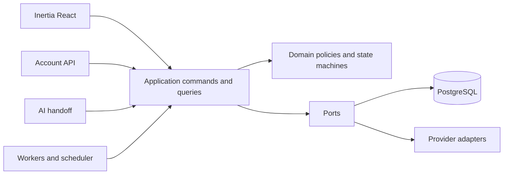
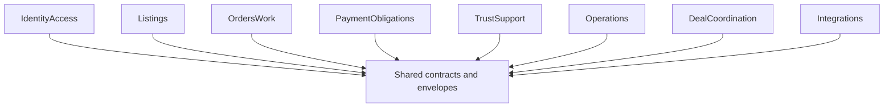
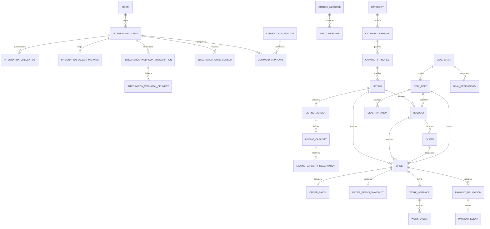

# Architecture Spine — Serbizyu Marketplace Platform

## Design Paradigm

**Modular monolith with hexagonal ports and adapters.** Each bounded module owns its domain state, application commands/queries, and persistence adapter. First-party Inertia HTTP, account-scoped APIs, AI-assisted tools, queue workers, schedulers, and external providers are adapters that call the same application ports.



## Invariants & Rules

### AD-1 — Canonical authority chain [ADOPTED]

- **Binds:** all
- **Prevents:** historical mockups, legacy code, or superseded documents silently redefining product behavior.
- **Rule:** Founder decision register → rebuilt PRD/taxonomy → UX → domain/state → canonical schema/ERD → ADRs/architecture → epics/OpenSpec → implementation. Legacy code is evidence only.

### AD-2 — Full contract, phased activation [ADOPTED]

- **Binds:** E0–E9
- **Prevents:** both one-off extension seams and a coupled big-bang release.
- **Rule:** The founder-approved initiative direction fixes the complete platform boundary; canonical artifacts propagate new decisions before implementation. Delivery proceeds through dependency-ordered trains, and every conditional, sandbox, or future capability has a server-side activation gate.

### AD-3 — Brownfield module ownership and dependency direction [ADOPTED]

- **Binds:** all application code
- **Prevents:** namespace forks, cross-module imports, and shared-table mutation from multiple owners.
- **Rule:** Ratify the existing module names. `IdentityAccess` owns users, OTP, profiles, roles, verification, delegation, and consent; `Listings` owns categories, capability profiles, listings, versions, capacity/reservations, requests, and quotes; `OrdersWork` owns Orders, parties, terms, Work, and Work events; `PaymentObligations` owns obligations, payment/provider events, policy versions, ledger, reconciliation, refunds, and release; `TrustSupport` owns evidence, disputes, holds, safety, conversations, messages, notifications, and support; `Operations` owns audit, outbox/inbox, idempotency, cohorts, activations, checkpoints, jobs, and recovery. New `DealCoordination` and `Integrations` modules own only their named aggregates. Modules depend only on their own domain/application contracts and neutral `Shared` contracts; cross-module commands use application ports, and only the owning module writes its aggregates.



### AD-4 — Separate commercial, fulfillment, payment, and trust truth [ADOPTED]

- **Binds:** Orders, Work, Payment, Evidence, Disputes, Holds
- **Prevents:** payment implying completion, uploads implying acceptance, or cancellation deleting history.
- **Rule:** Order, Work Instance, Payment Obligation, Evidence, Dispute, Consent, and Hold retain separate states, actors, guards, versions, events, and terminal conditions.

### AD-5 — Proposal and final Order formation seams [ADOPTED]

- **Binds:** Direct Booking, Quote Request, Reverse Bidding, Quick Deal, Deal-Chaining child agreement
- **Prevents:** mechanisms creating children at incompatible lifecycle points or inventing parallel Order models.
- **Rule:** `SubmitOrderProposal` may create only a `pending_acceptance` Order/proposal record and no required Work or Payment child. `FinalizeOrderAgreement` is the sole final-formation command after every required acceptance is current. It carries a discriminated source and immutable source versions, party/acceptance proofs, terms input, Work and Obligation specifications, expected versions for every guarded source, actor/client context, correlation ID, and idempotency key. Success atomically creates an `accepted` Order, immutable terms, parties, required Work, required Obligations, audit, idempotency result, and outbox; failure creates none. A standing active listing or valid provider quote may serve as provider acceptance only when its capability policy explicitly says so.

### AD-6 — Immutable business versions and accepted terms [ADOPTED]

- **Binds:** Orders, quotes, listings, category/capability policy
- **Prevents:** mutable concurrency counters or later catalog/policy edits rewriting historical eligibility.
- **Rule:** Governed artifacts have a stable family identity, immutable published business-version identity, and separate optimistic `row_version`. Listing versions pin exact category and capability-profile business versions; accepted Order terms pin exact listing, quote where present, category, capability, and policy versions plus normalized safety/data/mechanism/shape/lane terms. Published versions are append-only. Changes create a new business version or explicit terms amendment/cancellation/supersession with affected-party consent.

### AD-7 — Common Work kernel with shape adapters [ADOPTED]

- **Binds:** A1, A3, A4, A9
- **Prevents:** a universal payload with ambiguous fields or four incompatible lifecycle implementations.
- **Rule:** Every Work Instance follows the common lifecycle and stores `{shape_code, shape_contract_version, payload_schema_version, payload}` separately from aggregate `row_version`, event contract version, and artifact/revision numbers. Accepted structure is immutable; changes append a versioned event or affected-party terms amendment. The registry retains readers/validators for every referenced version and parks unknown versions as `work_contract_version_unsupported` with no state effect. Each shape owns its transition policy:
  - A1: scope, deliverables, progress, revisions, completion proposal.
  - A3: slot reservation, attendance, reschedule/no-show, safety context.
  - A4: capacity, preparation, pickup/handoff, receipt, mismatch.
  - A9: artifact/version, secure access, revisions, acceptance, retention/deletion.

### AD-8 — Governed taxonomy activation [ADOPTED]

- **Binds:** categories, capability profiles, listings, admin UX
- **Prevents:** open CRUD enabling unsupported or unsafe workflows.
- **Rule:** Categories and capability profiles move through draft → review → active → paused/retired. Activation validates listing type, mechanism, Work shape, lanes, access tiers, safety/data class, operations owner, and version. Referenced records are never hard-deleted.

### AD-9 — Shape-safe capacity buckets and reservations [ADOPTED]

- **Binds:** product stock, service capacity, A3 slots, A4 handoff, Order formation
- **Prevents:** overselling, double-booking, stale external updates, and leaked reservations.
- **Rule:** A capacity bucket is identified by listing, immutable listing version, capacity type, and resource/slot key. A reservation is a separate owned record with reservation ID, bucket, quantity or slot, source mechanism, command/idempotency identity, optional Order, status `held|committed|released|expired`, expected bucket version, and expiry where applicable. Final formation changes `held` to `committed` in the Order transaction; decline/expiry/cancellation uses one idempotent release transition. A3 supports multiple slots, quantity reservations lock the bucket and never drive remaining below zero, and external sync conflicts never overwrite committed marketplace reservations.

### AD-10 — Serbizyu is marketplace system of record [ADOPTED]

- **Binds:** account integrations and AI handoff after the T0 propagation gate
- **Prevents:** an external shop or AI agent silently overriding marketplace Orders, Work, money, consent, disputes, or evidence.
- **Rule:** Founder direction on 2026-08-09 approves account integrations as a platform capability. External systems may create/update authorized catalog data, synchronize capacity, read authorized projections, and submit approved commands; Serbizyu remains authoritative for every marketplace aggregate and transition. No permanent endpoint or migration begins until T0 propagates this direction through the PRD, domain, schema/ERD, ADR, UX, and epics and cites their stable revisions.

### AD-11 — Account-scoped service principals [ADOPTED]

- **Binds:** partner API, AI handoff, automation after the T0 propagation gate
- **Prevents:** shared human tokens, unattributed automation, cross-account IDOR, and scope expansion.
- **Rule:** Every integration client belongs to one owner account. Owner context is derived only from the authenticated client, never request data; all lookups, mappings, cursors, idempotency, and webhooks are owner/client-scoped. Credentials have an unguessable verifier, public selector, environment/audience, immutable granted-scope version, expiry, bounded rotation overlap, immediate fail-closed revocation, and strong hash or secret-manager reference. Issuance and scope expansion require recent attributable human step-up. Calls record client, owner, actor/acting-for context, correlation, idempotency, and audit attribution; cross-owner failures are non-enumerating.

### AD-12 — One application seam for UI, API, AI, and jobs [ADOPTED]

- **Binds:** all command adapters
- **Prevents:** API or AI bypassing policies enforced in controllers.
- **Rule:** Adapters translate transport input into the same typed command/query contracts. Authorization, validation, activation, transition guards, expected-version checks, idempotency, and transactional effects live below transport.

### AD-13 — Versioned integration contract [ADOPTED]

- **Binds:** account API and outbound webhooks after the T0 propagation gate
- **Prevents:** per-shop bespoke endpoints, breaking sync behavior, replay, and webhook SSRF.
- **Rule:** Publish `/api/v1` resource/command contracts, cursor change feeds, idempotent writes, stable conflicts, rate limits, signed webhooks, replay protection, retries, and revocation. Webhook validation and every delivery reject private/loopback/link-local/reserved/metadata IPv4/IPv6 destinations, revalidate DNS and redirects, pin the validated connection address, verify TLS, restrict egress/ports, and bound time/response size. Arbitrary customer code never executes inside Serbizyu.

### AD-14 — Provider-neutral payment domain [ADOPTED]

- **Binds:** Direct Digital, Tiwala Protected Digital, provider events
- **Prevents:** Xendit response shapes or status names leaking into domain state.
- **Rule:** Payment application ports cover intent creation, authenticity verification, status query, refund/reversal, payout/release, and reconciliation. Adapters map provider events into canonical append-only payment events.

### AD-15 — Xendit sandbox trails contract tests [ADOPTED]

- **Binds:** E7
- **Prevents:** provider access blocking core implementation or sandbox behavior becoming the domain contract.
- **Rule:** The founder selected Xendit on 2026-08-09 as the first real sandbox adapter, subject to the cited research and every G6/live-money gate. Deterministic fake adapters and provider contract tests prove application behavior first. Another provider remains replaceable without changing Order, Work, Obligation, ledger, or UX contracts.

### AD-16 — Sandbox is not production money [ADOPTED]

- **Binds:** Direct Digital, Tiwala, reporting, UX
- **Prevents:** configuration alone enabling live money, sandbox events entering pilot metrics, or Tiwala being represented as legal escrow.
- **Rule:** Connected lanes remain sandbox-only until an immutable lane/environment activation record references current G6 evidence, accountable owner, independent founder/financial/security/operations approvals, provider account/credentials, cohort, expiry, rollback, and incident owner. Sandbox/live accounts, secrets, endpoints, data classifications, metrics, and flags are separate and default-deny; runtime and persistence reject mismatches.

### AD-17 — Deal-Chaining coordinates independent children [ADOPTED]

- **Binds:** DealChain, DealNeed, DealDependency, DealInvitation
- **Prevents:** pooled money, sibling cascades, or invitation acceptance creating hidden Orders.
- **Rule:** A Need uses ordinary Request/Quote/Invitation sourcing; explicit child agreement creates one ordinary child Order. Parent progress/cost is derived. Dependencies block only declared transitions; no automatic sibling cancellation, refund, release, dispute, or liability reassignment.

### AD-18 — Atomic state, audit, outbox, and ordered consumption [ADOPTED]

- **Binds:** every state-changing command and asynchronous consumer
- **Prevents:** committed state without attribution, duplicate side effects, or projections/webhooks regressing under reordering.
- **Rule:** Aggregate mutation, append-only event/audit record, idempotency result, and outbox intent commit in one transaction. Events carry event and payload contract versions, aggregate type/ID/version/sequence, causation, correlation, actor/client, and occurred/effective times. Every consumer records inbox/deduplication state, applies only the next aggregate sequence, ignores repeats, parks gaps, and dead-letters unsupported versions without business acknowledgment.

### AD-19 — Operations are part of capability completion [ADOPTED]

- **Binds:** all activated capabilities
- **Prevents:** happy-path readiness without recovery or disable controls that strand in-flight obligations.
- **Rule:** A capability is incomplete without denials, retries, dead-letter/support recovery, admin inspection, reconciliation, health/alerts, retention, backup/restore evidence, activation, and rollback. Financial containment separately gates new intents/charges, release/payout, refund/reversal, outbound jobs, inbound event intake, provider query, and reconciliation; queued effects re-check gates, while disabling new money movement preserves authenticated intake, reads, reconciliation, and authorized recovery.

### AD-20 — UX contract precedes interface completion [ADOPTED]

- **Binds:** all user-facing capabilities
- **Prevents:** backend states that cannot be explained or recovered from in the UI.
- **Rule:** Each LLD defines actor intent, visible state, one primary action, authorization, safe copy, errors, recovery, low-data/accessibility behavior, and browser/UAT evidence. Pest proves server contracts; it does not substitute for browser or human UX validation.

### AD-21 — Canonical schema propagation gate [ADOPTED]

- **Binds:** T0 and all later integration/platform-kernel implementation
- **Prevents:** adding tables against a stale 46-table authority or hiding credentials, approvals, reservations, and delivery state in JSON.
- **Rule:** T0 first reconciles the migrated 47-table baseline, including `auth_otps`, then amends the canonical schema, ERD, catalog test, retention classes, and migration order with eleven explicit additions: `category_versions`, `listing_capacity_reservations`, `integration_clients`, `integration_credentials`, `integration_object_mappings`, `integration_webhook_subscriptions`, `integration_webhook_deliveries`, `integration_sync_cursors`, `inbox_messages`, `capability_activations`, and `command_approvals`. The approved target is 58 application tables. No related migration or endpoint begins before each table has explicit columns, FKs/delete behavior, checks, uniqueness/indexes, retention, causality, rollback, and source authority.

### AD-22 — Human account ownership precedes organization tenancy [ADOPTED]

- **Binds:** account integrations
- **Prevents:** speculative multi-tenant organization semantics entering the current program.
- **Rule:** Initial integration ownership references one Serbizyu user account. Organization/team membership is deferred to a separate domain decision; no polymorphic owner field or weak `context_type/context_id` substitute is allowed.

### AD-23 — One-lane obligations and balanced financial truth [ADOPTED]

- **Binds:** every payment, fee, refund, reversal, release, payout, chargeback, and correction effect
- **Prevents:** event-only/net-balance implementations, cross-currency posting, and history overwrite.
- **Rule:** One Payment Obligation has one immutable lane. Every money effect creates exactly one immutable source-event/idempotency-linked financial transaction whose debits equal credits per currency; each entry currency must match its active account and transaction. Corrections are linked compensating transactions. Reconciliation explicitly compares Obligation/event, provider object/settlement, and ledger state; mismatch blocks release/payout and manual resolution appends evidence, actor/approval, and any correction.

### AD-24 — Locked runtime and environment envelope [ADOPTED]

- **Binds:** E0–E9 runtime, deployment, and promotion
- **Prevents:** incompatible process topology, merged evidence planes, and optional infrastructure becoming correctness authority.
- **Rule:** Nginx→PHP-FPM web, PostgreSQL, Redis, queue worker, scheduler, and private evidence adapter are required processes/services with health signals; Node SSR is a separate presentation process with safe client-render fallback. PostgreSQL search and polling/notifications are baselines; Meilisearch and Reverb are optional measured adapters. Local/test Compose is the reference topology, hosting remains deployment-neutral, and local/test, capstone sandbox, genuine pilot, and production data/secrets/metrics are separated. Forward-compatible migrations, backups, restore rehearsal, promotion evidence, and rollback/disable precede activation.

### AD-25 — Order Management coordinates final formation [ADOPTED]

- **Binds:** `FinalizeOrderAgreement`
- **Prevents:** partial reservations, accepted Orders without children, and required creation via eventual jobs.
- **Rule:** `OrdersWork` Order application service owns one PostgreSQL formation transaction and calls transaction-bound `Listings`, `OrdersWork` Work, `PaymentObligations`, and `Operations` ports under the same command context. Lock order is source/listing/capacity → Order → Work → Obligation → integrity records. Any validation/version/constraint/child failure rolls back all writes; only post-commit effects use outbox/jobs.

### AD-26 — Relational source and child lineage [ADOPTED]

- **Binds:** category/profile/listing versions, capacity, Deal lineage, accepted terms, Work-linked Obligations
- **Prevents:** cross-listing versions, cross-chain replacements, mismatched Request/Quote lineage, accepted Orders without terms, and Obligations linked to another Order's Work.
- **Rule:** T0 adds composite relational guards: listing versions pin category/profile business versions; capacity bucket/version belongs to the same listing; current published listing version is relationally enforced; Deal replacement stays in the same Chain; Quote lineage equals its Request; accepted Order points to its same-Order terms snapshot; optional Obligation→Work linkage proves both share the same Order.

### AD-27 — Activation dimensions and safe disable semantics [ADOPTED]

- **Binds:** every UI/API/AI/job command
- **Prevents:** one adapter bypassing flags or disablement corrupting accepted work.
- **Rule:** Commands declare environment, cohort, geography, owner, category/profile version, mechanism, Work shape, lane/provider, and client/adapter dimensions. `NULL` is wildcard. Owning services re-evaluate immediately before every mutation/queued irreversible effect. Any current matching deny is absolute and cannot be overridden by a narrower enable; enablement requires zero matching denies plus at least one current enable, with specificity used only for attribution. Same-fingerprint effective ranges never overlap. Disabled commands return stable `capability_inactive` with no effect while reads, support, reconciliation, refunds/reversals, evidence retention, and safe completion/cancellation remain available; accepted snapshots are never rewritten.

### AD-28 — Provider, evidence, and webhook security boundaries [ADOPTED]

- **Binds:** provider inbox, account webhooks, evidence access
- **Prevents:** authentic-but-wrong provider effects, replay, SSRF, evidence IDOR, and active-content delivery.
- **Rule:** Provider verification binds canonical raw bytes, allowed algorithm/header, constant-time comparison, replay window, provider account/environment/object, owner, amount, currency, expected transition, and stable business-effect key; unknown/malformed/mismatched outcomes persist as `reconciliation_required` with no effect. Evidence remains quarantined until signature/type/size/scan pass; access is checked at grant and retrieval against aggregate participant/admin purpose/data class/hold, uses private server-generated keys and short-lived non-cacheable isolated-origin downloads, disallows unsafe active content, and audits grant/denial/download/deletion/hold/purge.

### AD-29 — Exact approvals and separation of duties [ADOPTED]

- **Binds:** AI commands and privileged admin/financial/security actions
- **Prevents:** stale/general AI consent, self-approval, and configuration-only live-money promotion.
- **Rule:** Model output is never authority. Confirmation-required AI or privileged actions use short-lived single-use exact approval consumed atomically. Money, consent, dispute, evidence export, holds, mismatch, correction, release/payout, and activation follow the deny-by-default maker/checker matrix. Owner credential issuance/rotation within current scopes, scope reduction, and immediate revocation require recent step-up; scope expansion, environment changes, and webhook-signing-secret changes also require an independent Operations checker. Emergency revocation never waits for a checker. Initiator cannot approve, and any emergency override is separately scoped, alerted, audited, and reviewed.

## Consistency Conventions

| Concern | Convention |
| --- | --- |
| IDs | UUIDv7 application-generated; foreign keys explicit. |
| Money | Integer minor units plus ISO-4217 currency; no floats. |
| Time | UTC persistence; presentation timezone is explicit. |
| Commands | Verb+noun, typed input, actor/client, target, expected version, correlation ID, idempotency key. |
| Events | Past tense, versioned payload, append-only, aggregate and causation references. |
| Errors | Stable safe error code, message, field errors, correlation ID, retryability; no sensitive/provider leakage. |
| Authorization | Laravel Policies/Gates at the application boundary; service-principal scopes add restrictions and never expand owner authority. |
| State | Backed PHP enums plus model casts and database checks generated from the domain contract. |
| Configuration | Published immutable policy/capability versions; current configuration never rewrites snapshots. |
| HTTP | Named first-party routes; versioned partner API; Form Requests at the transport boundary. |
| Reads | Purpose-specific projections; public, owner, partner, admin, and financial views expose different fields. |
| Tests | Pest domain-transition, feature, authorization, contract, idempotency, concurrency, and failure/recovery tests; browser tests for connected UX. |

## Stack

| Name | Version |
| --- | --- |
| PHP | 8.4 |
| Laravel Framework | 12.65.0 |
| Laravel Boost | 2.5.3 |
| Inertia Laravel | 3.x |
| Inertia React | 3.6.1 |
| React / React DOM | 19.2.8 |
| TypeScript | 5.9.3 |
| Node.js | 22 LTS |
| Vite | 7.3.6 |
| Nginx | 1.29 |
| PostgreSQL / PostGIS | 16 / 3.5 |
| Redis | 7.4 |
| Pest | 4.7.7 |

## Structural Seed

```text
app/
  Modules/
    IdentityAccess/          # identity, OTP, profile, roles, delegation, consent
    Listings/                # taxonomy, capability, listing, capacity, request, quote
    OrdersWork/              # Order and Work application/domain seams
    PaymentObligations/      # obligations, providers, ledger, reconciliation
    TrustSupport/            # evidence, disputes, holds, safety, communication, support
    Operations/              # audit, outbox/inbox, activation, jobs, metrics, recovery
    DealCoordination/        # chains, needs, dependencies, invitations
    Integrations/            # service principals, account API, mappings, webhooks
  Shared/
    Contracts/               # neutral cross-module command/event/value contracts only
```



## Capability → Architecture Map

| Capability / Area | Lives in | Governed by |
| --- | --- | --- |
| Foundation, runtime, operations, recovery | `Operations` + platform runtime | AD-1–3, AD-18–19, AD-24, AD-27 |
| Phone identity, onboarding, roles, delegation, consent | `IdentityAccess` | AD-3–4, AD-11–12, AD-29 |
| Governed categories and profiles | `Listings` | AD-6, AD-8, AD-21, AD-26 |
| Listing, capacity, browse/detail | `Listings` | AD-8–9, AD-20–21, AD-26 |
| Requests, quotes, reverse bidding | `Listings` → Order port | AD-5–6, AD-25 |
| Direct Booking and Quick Deal | `OrdersWork` Order seam | AD-5–6, AD-25 |
| A1/A3/A4/A9 fulfillment | `OrdersWork` Work seam | AD-4, AD-7, AD-26 |
| Payment lanes, ledger, Xendit sandbox | `PaymentObligations` | AD-4, AD-14–16, AD-23, AD-28–29 |
| Evidence, safety, disputes, communication, support | `TrustSupport` | AD-4, AD-19–20, AD-28–29 |
| Deal-Chaining | `DealCoordination` → Order port | AD-5, AD-17, AD-25–27 |
| Account integrations | `Integrations` → application ports | AD-10–13, AD-21–22, AD-27–29 |
| AI assistance | AI adapter → application ports | AD-10–12, AD-27, AD-29 |
| Cohort and launch readiness | `Operations` | AD-2, AD-16, AD-19, AD-24, AD-27, AD-29 |

## Deferred

- **Organization/team tenancy:** revisit before a provider needs multiple human members, shared ownership, or organization-level billing/credentials.
- **Production Direct Digital/Tiwala:** blocked on G6 evidence; sandbox architecture does not pre-approve live money.
- **Air-gapped Quick Deal:** blocked until protocol/device testing proves safe synchronization; no offline irreversible authority.
- **Provider selection beyond Xendit:** port is fixed; select another adapter only from verified contract/geography/operations needs.
- **Public integration SDKs and marketplace:** API contract comes first; SDK language and app marketplace wait for real integrator demand.
- **Full customer frontend:** detailed journey/LoFi contracts accompany LLD packets; production UI follows backend contract evidence and design-kit founder selection.
