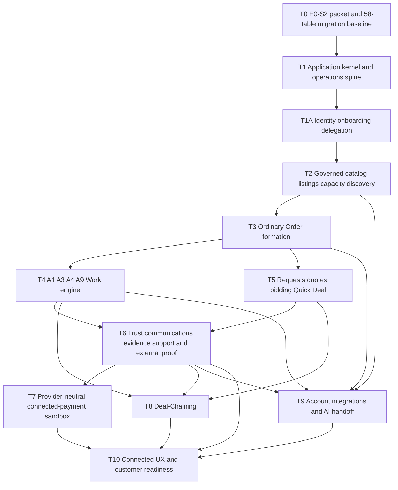
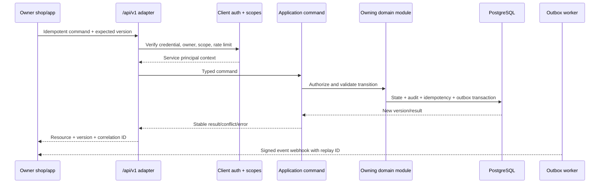

# Serbizyu Platform Implementation Program

## 1. Program outcome

Build the complete Serbizyu marketplace backend contract without coupling every capability to one release date. The program covers governed categories, listings, capacity, discovery, requests, quotes, reverse bidding, Quick Deal, ordinary Orders, all four initial Work shapes, four payment lanes, Deal-Chaining, account integrations, operations, and detailed UX contracts.

**Implementation rule:** every train produces executable backend behavior, Pest evidence, recovery behavior, and an activation boundary. Detailed LoFi/UX contracts are produced with the backend LLD; polished connected frontend follows once the relevant backend train is stable.

## 2. Current baseline and gaps

| Area | Existing evidence | Gap before implementation-ready |
| --- | --- | --- |
| Identity / delegation | Phone OTP + sessions (pre-2026-08-10). **Auth reopen accepted 2026-08-10:** strict mobile signup; multi-method sign-in (email/password, SMS, Google — live gated). | Implement hybrid auth packet; multi-step onboarding; identity review; role/delegation/consent; recovery; factories/seeders. |
| Catalog / Listings | Tables, lifecycle commands, owner/public projections, browse/detail interfaces | Immutable category/profile business versions, governed activation, shape-safe reservations, search/filter/pagination, admin surfaces, and removal of legacy fixture ownership. |
| Order / Work | `orders`, parties, terms, Work, events, migrations and constraints | Proposal/final-formation command split, transaction coordinator, domain policies, version registry, projections, and complete A1/A3/A4/A9 behavior. |
| Requests / Quotes / Deal | Canonical tables and planning contracts | Request/quote/bidding/Quick Deal commands and complete Deal-Chaining application behavior. |
| Payments / financial | Obligations, provider events, policy and ledger tables | One-lane enforcement, balanced posting API, provider ports, Xendit sandbox, release/refund/reversal, reconciliation, separation of duties, and operations behavior. |
| Trust / communication | Evidence, dispute, hold, safety, message, notification, and support tables | Quarantine/access/retention services, conversation authorization, dispute/hold policies, notification fallback, and recovery UX. |
| Integrations / AI | Founder-approved canonical contract; no permanent implementation | T9 LLD/OpenSpec, six integration migrations, owner-scoped credentials, `/api/v1`, secure webhooks, exact approvals, AI adapter, and activation evidence. |
| Operations / runtime | Audit/outbox/idempotency plus Compose web/app/db/Redis/Mailpit | Inbox ordering, activation/approval records, queue/scheduler/SSR topology, jobs, dead-letter recovery, reconciliation, restore rehearsal, and environment separation. |
| Schema authority | Accepted 58-table planning inventory; 47 tables currently migrated including `auth_otps` | E0-S2 LLD/OpenSpec, Batch 0–9 migration/rollback implementation, catalog/constraint proof, and restore rehearsal. |
| UX | Rebuilt UX contract and approved/throwaway surfaces | Detailed state/error/recovery/low-data contracts and connected browser/UAT evidence for onboarding, Order/Work, financial, governance, integration, and Deal-Chaining surfaces. |

## 3. Accepted authority and implementation-entry gate

The founder-accepted rebuilt PRD, domain/state, canonical schema/ERD, ADR, architecture, UX, and epic sources now contain the full initiative contract. They authorize dependency-ordered planning, not an unreviewed omnibus implementation.

Before permanent code for any train:

1. T0 produces the dedicated E0-S2 LLD/OpenSpec and verifies every source revision, state/enum/version matrix, migration/backfill/rollback step, authorization boundary, and evidence owner.
2. The 47-table migrated baseline is reconciled to the accepted 58-table target through Batch 0–9, with clean and in-place rehearsals, catalog/constraint tests, backup/restore proof, and no production migration.
3. Each later train receives its own mandatory §6 LLD/OpenSpec, activation/default/disable contract, executable acceptance evidence, and explicit dependency on completed upstream seams.
4. Historical mock/demo ownership and superseded planning counts remain non-authoritative; local/test records move to Laravel factories/seeders.

No permanent endpoint or domain implementation for a train begins until its LLD/OpenSpec passes readiness and cites the accepted authority revisions.

## 4. Delivery dependency graph

Normative train-to-story ownership:

| Train | Owning canonical stories | Required predecessors |
| --- | --- | --- |
| T0 | E0-S2; consumes completed E0-S5 authority propagation | Accepted authority set |
| T1 | E0-S1, E0-S3, E0-S4; E6-S2, E6-S4, E6-S6 shared kernel | T0 |
| T1A | E1-S1–S4 | T1 |
| T2 | E2-S1, E2-S2, E2-S5, E2-S6 | T1A |
| T3 | E3-S1, E3-S8 | T2 |
| T4 | E3-S2–S7, E3-S9 | T3 |
| T5 | E2-S3, E2-S4; E9-S1/S2 capability contracts | T3 |
| T6 | E4-S1–S4; E5-S1–S5; E6-S1, E6-S5; E8-S1–S3 after the named E6 seams | T4, T5 |
| T7 | E6-S3 first, then E7-S1–S3 | T6 |
| T8 | E9-S5 | T4, T5, T6 |
| T9 | E9-S7, E9-S8 | T2, T3, T4, T6 |
| T10 | E9-S6, E9-S9; connected capability PRD-075 UAT gates | T6, T7, T8, T9 |

## 5. Delivery trains

### T0 — E0-S2 packet, migration baseline, and implementation boundary

**Goal:** turn accepted planning authority into an executable, reviewable implementation boundary before permanent domain behavior.

Deliverables:

- Publish the dedicated E0-S2 LLD/OpenSpec with exact accepted source revisions and no unresolved authority question.
- Implement and rehearse the 47→58 Batch 0–9 migration/backfill/rollback plan in disposable PostgreSQL, including clean-build and in-place paths.
- Render and compare the canonical ERD, 58-table inventory, migration manifest, catalog, constraints, indexes, retention, and checksums.
- Lock brownfield module ownership and cross-module ports from AD-3/AD-25.
- Generate state/enum/version/transition matrices from the accepted domain contract.
- Record capability defaults and all environment/cohort/geography/owner/category/mechanism/shape/lane/provider/client activation dimensions.
- Record legacy demo/fixture ownership as removal work; preserve local/test data only through Laravel factories/seeders.
- Create one passing-readiness OpenSpec change per later train; no omnibus implementation change.

Exit evidence:

- Every spine decision resolves to an approved upstream authority revision.
- Rendered ERD, canonical inventory, migrations, and catalog/constraint tests agree on 58 tables.
- Composite lineage, business-version, reservation, ledger-currency, and accepted-child constraints have executable PostgreSQL examples.
- Every later train has scope, dependencies, activation/default, rollback/disable behavior, evidence owner, and no unresolved authority question.

### T1 — Application kernel and operations spine

**Goal:** build shared behavior once before domain modules multiply.

Deliverables:

- Typed actor context for human user, account-scoped service principal, optional acting-for consent, and system job.
- Command metadata: expected source/aggregate versions, correlation/causation IDs, idempotency scope/key, evidence, policy and activation versions.
- Stable success/error envelopes and non-enumerating authorization denials.
- Transactional audit + versioned outbox + idempotency result pattern.
- Consumer inbox with per-aggregate sequence, duplicate ignore, gap parking, unsupported-version dead letter, and replay tooling.
- Queue worker and scheduler processes, retry classes, dead-letter/support recovery, job last-success, and health/alert contracts.
- Dimensioned capability activation query and fail-safe financial effect gates.
- Single-use exact command approvals and maker/checker policy primitives.

Exit evidence:

- Same-scope/same-payload duplicate returns the prior result; a different payload under the same key is rejected.
- Concurrent stale source/aggregate command returns a stable conflict with safe recovery data.
- State, audit, idempotency, and outbox commit together; side-effect retry cannot repeat mutation.
- Reordered, repeated, gapped, and unsupported events cannot regress a projection or acknowledge a missing business effect.
- Service principal can never exceed owner/client scopes; AI cannot convert general consent into command approval.
- Disabled capabilities block every adapter and queued irreversible effect while preserving required reads/recovery.

### T1A — Identity, onboarding, delegation, and recovery

**Goal:** complete the E1 backend authority path before marketplace capabilities depend on account readiness or acting-for consent.

Deliverables:

- Phone-authenticated multi-step onboarding with persisted profile/readiness state, resumable validation, and explicit identity-review separation.
- Additive Buyer/Provider/Agent/Admin capabilities, access tiers, deny-by-default Laravel Policies, and non-enumerating recovery.
- Government-ID evidence intake/review/reject/resubmit/retention/deletion/access-audit workflow, disabled outside approved environments.
- Owner-scoped consent grants with purpose, actions, resources, expiry, revocation, notices, and attributable Agent acting-for context.
- Native Laravel factories/seeders for deterministic local/test identities and profiles; no permanent fixture repository or mock-auth middleware.

Exit evidence:

- OTP→onboarding→ready-session works across refresh and resumes incomplete steps without exposing secrets or fictional credentials.
- Suspended/revoked/expired/wrong-owner access fails safely; role capabilities remain additive.
- Revoked or expired consent blocks future Agent commands while preserving immutable attribution and history.
- Sensitive identity evidence is private, held/deleted by policy, and never enabled by configuration alone.

### T2 — Governed catalog, listings, capacity, and discovery

**Goal:** make the source side trustworthy enough to form Orders.

Deliverables:

- Category family and immutable published `category_versions`; capability-profile business versions with separate `row_version`.
- Governed category/profile commands: create draft, revise, submit review, approve, activate, pause, retire.
- Capability policy covering listing type, mechanisms, Work shape/contract, lanes, access tiers, safety/data class, operations owner, and activation evidence.
- Listing lifecycle completion and immutable published listing versions pinned to exact category/profile versions.
- Capacity bucket identity for quantity, slot/resource, service availability, and request-based availability.
- Separate hold/commit/release/expire reservation commands with expected bucket version and source-command identity.
- Browse search/filter/sort/cursor pagination and public listing detail projections.
- Admin category/profile/listing review and reservation-conflict projections.

Exit evidence:

- Unsupported or unapproved category/profile version cannot publish a listing or form an Order.
- Published business versions cannot be deleted/reused/rewritten; `row_version` changes do not change semantic identity.
- Cross-listing version/reservation references fail at the database boundary.
- Product quantity and multiple A3 slots reject oversell/double-booking under concurrent tests; terminal paths release exactly once.
- Public projections exclude private owner, evidence, internal policy, client, reservation, and moderation fields.
- Search degradation returns an explicit usable PostgreSQL fallback.
- Search failure returns a usable database-backed fallback.

### T3 — Ordinary Order formation and immutable terms

**Goal:** create the one authoritative Order seam every mechanism uses.

Deliverables:

- Discriminated `SubmitOrderProposal` and `FinalizeOrderAgreement` command/value contracts for listing, quote/bid, Quick Deal, and Deal-Need sources.
- Acceptance-proof policy, including when an active listing/valid quote is standing provider acceptance.
- Order-owned transaction coordinator using transaction-bound Listing/Capacity, Work, Obligation, and integrity ports in fixed lock order.
- Finalization atomically validates current source/category/profile/policy/capacity/party acceptance and creates accepted Order, parties, exact terms snapshot, required Work, one-lane Obligations, committed reservations, audit, idempotency result, and outbox.
- Proposal/accept/decline/cancel-request/cancel-decision/close policies; pending proposals cannot own required Work or Obligations.
- Buyer, provider, admin, owner, and public-safe projections and Laravel Policies.

Exit evidence:

- Stale listing/capacity/category/profile/policy/acceptance cannot form an Order.
- Any child/constraint failure leaves no accepted Order, committed reservation, Work, Obligation, audit success, or outbox.
- Duplicate submission cannot create duplicate proposals, Orders, children, or reservations.
- Accepted Order has same-Order terms and required children; optional Obligation→Work is same-Order.
- Accepted terms remain unchanged after later catalog/policy edits; close is blocked by nonterminal Work/Obligations/Disputes/Holds.

### T4 — A1/A3/A4/A9 Work engine

**Goal:** implement all four planned fulfillment shapes without a universal ad hoc payload.

Shared deliverables:

- Common Work state machine and one version registry resolving a profile to `shape_code`, `shape_contract_version`, and `payload_schema_version`.
- Shape payload validators/readers retained for every referenced version; aggregate `row_version`, event version, and artifact/revision version remain distinct.
- Unknown/unavailable contract version parks the command/event with stable `work_contract_version_unsupported`, no state effect, admin diagnosis, and safe actor recovery.
- Versioned transition commands, evidence requirements, projections, and labels.
- Progress, completion proposal, buyer sign-off/review-expiry, dispute, cancellation, failure, and amendment behavior.

Shape packets:

| Shape | Required commands and invariants |
| --- | --- |
| A1 Linear Project | Start, record progress, request revision, submit revision, propose completion, sign off; scope/deliverables and revision rules snapshot. |
| A3 Appointment | Request/reserve slot, confirm, reschedule, cancel, mark attendance/no-show, propose completion; atomic slot ownership and safety/location copy. |
| A4 Handoff | Reserve quantity, mark preparing/ready, record pickup/handoff, buyer receipt, mismatch/variance, return/support; payment never implies receipt. |
| A9 Digital Delivery | Register artifact version, grant secure access, record delivery/view, request revision, accept, expire/delete by policy; upload never implies acceptance. |

Exit evidence:

- Invalid shape transition is rejected in domain, HTTP, API, and job adapters.
- Payment event cannot complete Work.
- Hold/dispute blocks completion and protected release where required.
- Retry does not duplicate evidence/events.
- Each shape has boundary, concurrency, authorization, cancellation, and recovery tests.

### T5 — Requests, quotes, reverse bidding, and online Quick Deal

**Goal:** add formation mechanisms that converge on T3.

Deliverables:

- Service/Product Request lifecycle with privacy, safety, budget, timing, geography, expiry.
- Quote response/version/clarification/decline/expiry/acceptance.
- Reverse-bidding eligibility, response limits, anti-spam, expiry, selection, and liquidity activation.
- Online Quick Deal proposal, counterparty confirmation, expiry, replay safety, and explicit Order formation.
- A4 purchase-on-behalf extension with item list, budget, alternatives, approval, actual cost, variance, receipt, service fee, and handoff.

Exit evidence:

- Expired/ineligible/declined quote or bid cannot form an Order.
- Selection/confirmation creates exactly one immutable ordinary Order.
- Quick Deal is never Work completion or payment authority.
- Offline mode cannot authorize final inventory, consent, payment, release, or Order formation.

### T6 — Trust, communications, evidence, support, and external proof

**Goal:** complete the E5 backend recovery and trust plane while making real low-barrier pilot evidence lanes operational.

Deliverables:

- Private evidence storage port with server-generated keys, quarantine, extension/MIME/signature/size validation, malware scan, safe transformation, isolated-origin retrieval, and active-content denial.
- Purpose- and aggregate-scoped short-lived access grants re-authorized at download time, no-store responses, access audit, retention/deletion/legal/operational hold.
- Conversation membership/policy, attributable messages, notification intents/delivery attempts/preferences/fallback, retry/dead-letter visibility, and no duplicate domain effect.
- Linked support cases, assignments, escalation, participant-visible recovery, and protected admin timelines across Order/Work/Obligation/evidence.
- Dispute intake, evidence, administrative holds, attributable resolution/correction effects, review eligibility, safety report/block/escalation, and safer-meeting guidance.
- External Cash buyer/provider declarations, acknowledgment/mismatch/dispute/correction, and External Digital Proof verification/rejection/supersession.
- Payment Obligation one-lane policy/fee/due-condition snapshot and guarded admin evidence export.
- T6 owns the provider-neutral posting baseline: immutable source-event/business-effect identity, one balanced per-currency `financial_transaction` per accounting effect, account-currency checks, append-only compensation, and Obligation↔event↔ledger reconciliation. Unverified reports/mismatches remain non-posting events. Counterparty-confirmed External Cash posts debit `external_cash_settlement_control` / credit `obligation_satisfied_control`; trusted-provider-verified External Digital Proof posts debit `external_digital_settlement_control` / credit `obligation_satisfied_control`; correction/reversal posts the exact linked inverse. These are off-platform control accounts, never Serbizyu cash/commission receivables.
- Cohort classification, reproducible pilot metrics, operating cost/support effort, onboarding/training, capability activation review, and G3 readiness evidence execute after the named E6 operational seams and do not wait for E7/E9 sandbox/future capabilities.

Exit evidence:

- Screenshot/reference is never automatically provider-verified, payment proof, or completion proof.
- Unsafe/unscanned/quarantined/unauthorized evidence is never retrievable; guessed IDs and conversation membership do not enumerate.
- Notification retries and fallback are visible; failure opens a support path without repeating a state change.
- Holds block unsafe completion/release/purge; dispute, support, safety, review, correction, release, deletion, and purge remain attributable and preserve history.
- External Cash creates no platform commission receivable, custody claim, or automatic-refund promise.
- No T6 lane activates until its posting templates, balance/currency checks, idempotent effect keys, and Obligation↔event↔ledger reconciliation tests pass; an event-only payment implementation is invalid.
- E8 readiness proves training, support capacity, category/profile activation, recovery, security/privacy, cohort classification, and red-line closure for the non-connected Tagudin plane; it cannot count sandbox/team/training records as genuine market evidence.

### T7 — Provider-neutral connected-payment sandbox

**Goal:** prove robust payment integration without allowing Xendit to define the domain.

Subtrain T7A — Provider and financial contracts:

- Ports for create intent, verify webhook, query status, refund/reverse, release/payout, and reconcile.
- Deterministic fake adapter covering duplicate, reordered, delayed, malformed, mismatched account/owner/environment/object/amount/currency, reversed, partially refunded, failed, and unavailable events.
- Provider inbox authenticates canonical raw bytes, replay window, account/environment/object, expected transition, and stable business-effect identity before effect.
- T7 extends the T6 posting/reconciliation baseline to connected-provider effects; every provider effect creates one immutable balanced transaction, account-currency checks apply, corrections compensate, and reconciliation adds the provider-object/settlement leg.

Subtrain T7B — Xendit sandbox:

- Separate sandbox account/secrets/endpoints/classification/metrics; credentials only from environment/secret store.
- Signature and business-binding verification before financial effect.
- Canonical mapping from Xendit sandbox events; unknown/mismatched events become visible `reconciliation_required`.
- Reconciliation query/job and admin mismatch queue with attributable resolution/correction.
- Independent gates for new intents, release/payout, refund/reversal, outbound jobs, inbound intake, query, and reconciliation.

Subtrain T7C — Tiwala simulation:

- Held/controlled sandbox state, release eligibility, review window, dispute/fraud/admin/legal holds, idempotent release, refund/reversal, ledger corrections.
- Exact command approvals and maker/checker separation for mismatch resolution, adjustment, refund/reversal, release/payout, and activation.
- Explicit sandbox/non-escrow evidence classification.

Exit evidence:

- Entire T7A suite passes without network access; unbound/replayed/provider-authentic-but-wrong events have no financial effect.
- Every transaction balances per currency and reconciles obligation/event↔provider↔ledger; mismatch blocks release.
- Xendit sandbox contract passes independently and another provider requires only an adapter/mapping suite.
- No sandbox record appears in genuine pilot/live metrics; production account/effects stay schema- and runtime-disabled without current approvals.

### T8 — Bounded Deal-Chaining capability

**Goal:** implement complete coordination while preserving child authority.

Deliverables:

- Chain, Need, Dependency, Invitation commands and policies.
- Ordered Need management; replacement/supersession stays in one Chain and cannot orphan an active child.
- Dependency add/remove with self-edge, duplicate-active-edge, same-Chain, and cycle guards.
- Invitation scope/expiry/revocation/response and Request/Quote sourcing adapters.
- Explicit child agreement through T3; invitation acceptance never implies formation.
- Derived progress/cost/blocked roll-up with partial completion/failure/replacement/support views.
- Detailed LoFi surfaces and activation; polished frontend follows T10.

Exit evidence:

- Invitation acceptance does not create an Order and one Need has at most one active child Order.
- Replacement or Quote/Request lineage cannot cross Chain/Need at application or database boundaries.
- Dependencies reject self-edge, duplicate active edge, cross-Chain edge, and cycle.
- Child cancellation/dispute/refund/release never cascades to siblings without a separately authorized command.
- Parent shows no pooled balance, escrow, custody, or parent-wide guarantee.

### T9 — Account integrations and AI handoff

**Goal:** let an owner automate listings/capacity safely and give future AI one controlled seam.

Deliverables:

- Integration schema and owner/client-scoped uniqueness in §7.
- Owner UI/application commands to create a client and choose scopes; recent step-up may issue/rotate credentials within approved scopes, reduce scopes, revoke immediately, and inspect activity/conflicts/webhook health. Scope expansion, environment changes, and webhook-signing-secret changes enter an exact approval set for an independent Operations checker; emergency revocation never waits for that checker.
- `/api/v1` listing, capacity, category/profile-read, Order/Work projection, and approved-command adapters; owner derives only from authenticated client.
- External object mappings, cursor feeds, stable conflict/replay behavior, and owner/client-scoped idempotency.
- Signed outbound webhooks with allow-listed events and DNS/IP/redirect-safe delivery on initial attempt and every retry.
- AI adapter using the same actor/client scopes; exact confirmation records for confirmation-required commands.

Initial scopes:

- `catalog:read`
- `listings:read`, `listings:create`, `listings:update`, `listings:submit`
- `capacity:read`, `capacity:update`
- `orders:read`
- `work:read`
- `webhooks:manage`

Order formation, Work transition, money, consent, dispute, credential administration, evidence export, hold, and activation commands remain absent until a separate deny-by-default policy explicitly adds them.

Exit evidence:

- Revoked/expired/wrong-environment credentials fail immediately; rotation overlap expires and is audited.
- Scope, owner, activation, resource policy, expected version, and where required exact human approval all pass.
- Activation tests prove any matching broad or narrow deny is absolute, no enable overrides it, same-fingerprint ranges do not overlap, absence denies conditional effects, and queued/adapter effects recheck at mutation time.
- Credential tests prove within-scope issuance/rotation and reduction/revocation require recent owner step-up, elevated changes require a distinct Operations checker, and emergency revocation remains immediate across web/workers/caches.
- Cross-owner IDs are non-enumerating; duplicate/stale stock update cannot erase held/committed reservations.
- Webhook DNS rebinding, redirect-to-private, private/metadata IPv4/IPv6, replay, and oversize response tests fail closed.
- AI cannot publish, form an Order, transition Work, charge/release, export evidence, resolve disputes, or consent from general permission.

### T10 — Connected UX and customer readiness

**Goal:** connect approved design surfaces to stable backend contracts and prove usability.

Deliverables:

- Founder-selected design-kit surfaces for §9.
- Inertia pages/forms with safe loading/empty/error/recovery states.
- Browser tests for critical paths; human UAT for comprehension, accessibility, low-data, and sandbox/payment language.
- Operations runbooks, training, backup/restore rehearsal, activation/rollback evidence.

Exit evidence:

- Browser journeys cover actor-visible state and recovery, not only HTTP success.
- Human review confirms Order/Work/payment/sandbox distinctions.
- Capability gates can disable a failing mechanism/shape/provider without corrupting ordinary Orders.

## 6. Standard LLD/OpenSpec packet contract

Every implementation change must include these sections. Missing or unresolved sections block implementation readiness.

1. **Intent and authority** — exact founder/PRD/UX/domain/schema/ADR/architecture/epic/story references and supersession impact.
2. **Scope/non-goals** — capability plane, environment/cohort/geography/category/mechanism/shape/lane/client activation status.
3. **Actors and authorization matrix** — human/service principal/system/acting-for, resource ownership, field visibility, step-up, exact approval, separation of duties.
4. **Commands and queries** — typed discriminated inputs/outputs, source proofs, expected versions, idempotency scope, stable errors.
5. **State/version model** — states, transitions, actors, guards, business vs row vs event/payload/artifact versions, terminal/recovery paths.
6. **Persistence/ERD delta** — executable columns/types/FKs/delete behavior/checks/composite and partial uniqueness/indexes/retention/migration order/backfill/rollback.
7. **Transaction and lock boundary** — aggregate order, reservations, required children, audit, events, idempotency, outbox, ledger, all-or-nothing failure.
8. **Event/consumer contract** — event and payload versions, aggregate sequence, causation/correlation, inbox/deduplication, gap/unsupported-version recovery.
9. **Async/operations** — processes/jobs/schedules/retries/dead-letter/replay/reconciliation/alerts/last-success/effect-specific kill switches.
10. **External adapter contract** — port methods, canonical mapping, authenticity plus business binding, timeout/retry/egress/circuit/degradation/contract tests.
11. **Privacy/security** — owner scoping, secrets/rotation/revocation, logs, SSRF, evidence quarantine/access, retention/deletion/hold, abuse/rate limits.
12. **UX contract** — actor intent, primary action, visible state/authority, copy, loading/empty/error/denial/conflict/retry/support, low-data/accessibility, sandbox language.
13. **Verification matrix** — domain, feature, policy/projection/privacy, PostgreSQL constraint/concurrency, idempotency, event ordering, failure/recovery, adapter, browser/UAT.
14. **Activation and rollback** — dimensions/default, approval/evidence owner/expiry, migration compatibility, in-flight disable behavior, data preservation.
15. **Implementation evidence** — exact tests/commands, browser paths/screenshots where applicable, operational evidence, and bounded gated assumptions.

## 7. Canonical 58-table ERD delta

T0 treats the current 47 migrated application tables as observed truth, reconciles the outdated 46-table catalog, then adds the following eleven tables:

| Table | Purpose | Required constraint/index/retention contract |
| --- | --- | --- |
| `category_versions` | Immutable published category policy/data version | FK category RESTRICT; unique category/business version; published content immutable; status/effective timestamps/checksum; retained while referenced. |
| `listing_capacity_reservations` | Hold/commit/release/expire quantity or slot | Composite FK proves capacity/listing-version ownership; optional same-Order link; positive quantity/valid expiry/status checks; unique source-command identity; partial indexes for active holds/commits. |
| `integration_clients` | User-account-owned service principal | Owner FK RESTRICT; unique owner/name; status and granted-scope version; environment/audience; no secret; archived while audited. |
| `integration_credentials` | Rotatable client credential | Client FK RESTRICT; globally unique public selector; strong hash/secret reference only; issued/expiry/revocation/overlap/checks; no plaintext recovery. |
| `integration_object_mappings` | External↔Serbizyu resource identity | Client/owner scoped; unique client/resource/external ID and client/internal ID; expected sync version; archived history. |
| `integration_webhook_subscriptions` | Owner endpoint and event allow-list | Client FK; normalized HTTPS endpoint, secret reference, environment/status/version; uniqueness scoped to client; endpoint/DNS validation evidence. |
| `integration_webhook_deliveries` | Signed outbound attempt history | Subscription/outbox FKs; unique subscription/event/attempt; payload contract/hash, destination snapshot, response class, retry/dead-letter; retained by audit policy. |
| `integration_sync_cursors` | Resumable pull stream | Client/resource-stream unique; monotonic cursor/version; reset reason/expiry/audit. |
| `inbox_messages` | Idempotent ordered event consumption | Unique consumer/event and consumer/aggregate/sequence; payload/contract version, status, gap/dead-letter/error/processed timestamps; retained through replay window. |
| `capability_activations` | Immutable dimensioned enablement/disable decision | Explicit environment/cohort/geography/owner/category/profile/mechanism/shape/lane/provider/client dimensions; evidence/approvals/owner/expiry/rollback; no mutable blanket boolean. |
| `command_approvals` | Exact single-use human/maker-checker approval | Actor/client/command/payload hash/targets/versions/scopes/amount/currency/policy/reason/evidence/expiry/idempotency; unique consumption; approver differs from initiator where required. |

Cross-cutting changes:

- `categories`, `capability_profiles`, `listings`, `listing_versions`, `listing_capacity`, quotes, terms, Work, and events separate immutable business/payload versions from `row_version`; composite FKs enforce lineage.
- `orders`/terms enforce accepted-order snapshot membership; obligations enforce one lane and optional same-Order Work linkage.
- `financial_entries` enforce entry currency equals active account and transaction currency; posting uses one database operation that proves per-currency balance.
- Deal replacement/dependency and Request/Quote lineage receive same-parent composite guards and partial uniqueness.
- `audit_events`, `idempotency_keys`, and command/event envelopes add nullable `integration_client_id` while preserving human/system actor and owner attribution.
- Business records retain owner user; client is attribution, not ownership. `outbox_messages` remains delivery source. No polymorphic owner or arbitrary JSON secret store.

## 8. API and handoff contract

Rules:

- Resource writes are commands, not arbitrary PATCH of persistence fields; owner/client context comes only from authenticated principal.
- Listing/capacity endpoints expose only owner-controlled fields; category/profile/policy fields are governed immutable references.
- Stock sync submits absolute value plus source version or guarded delta and cannot erase held/committed reservations.
- Outbound webhook URL validation is repeated for every attempt/redirect and pins the validated destination connection.
- AI may draft or explain. Confirmation-required actions need a current single-use exact approval; general or stale consent never authorizes execution.
- Every adapter evaluates the same dimensioned activation and effect-specific financial gate inside the application service.

## 9. Detailed UX capability map

| Surface | Actor / primary action | Visible authority and state path | Required error, recovery, low-data and accessibility behavior |
| --- | --- | --- | --- |
| Phone auth / onboarding | Guest/user — **signup** verify phone; **sign-in** via email/SMS/Google; complete profile | Signup: OTP → phone_verified; Sign-in: method picker → session → profile steps → ready; step-up OTP for high-trust; identity review distinct from auth | Method-safe errors, resend/expiry/attempt countdown, preserve non-sensitive progress, keyboard/focus/status announcements, text-first low-data path, support route. |
| Category/profile governance | Admin/operator — approve/activate | Draft → validation blockers → review → active → paused/retired; version and affected listings visible | Field-level blocker links, conflict refresh/compare, maker/checker attribution, safe pause/rollback preview, no color-only status. |
| Listing creation/review | Provider/owner/agent — submit eligible version | Draft → preview → submitted → pending review → active/rejected correction/unavailable; acting-for owner and version visible | Autosave status, validation summary, stale-version merge/reload, upload retry, capability/capacity blockers, leave-and-resume, low-bandwidth preview. |
| Browse/detail | Buyer/public — judge fit and choose mechanism | Skeleton/loaded/empty; availability, safety/trust summary, current version and Direct/Quote/Request action | Filters encoded in URL, pagination retry, PostgreSQL fallback disclosure without internal errors, unavailable alternative, semantic cards/headings, minimal-image mode. |
| Request/quote/bidding | Buyer/provider — submit/select response | Draft/open/clarification/responded/selected/declined/expired; response privacy and selection authority explicit | Eligibility/expiry/duplicate selection conflicts, preserve draft, safe retry, no losing response on network error, chronological text timeline. |
| Quick Deal | Buyer/provider — confirm exact proposal | Proposed → counterparty confirmation → accepted Order or expired/declined; never imply completion/payment | Exact terms/version comparison, replay-safe retry, stale/changed proposal requires reconfirmation, offline cannot finalize, plain-language authority warning. |
| Order detail | Buyer/provider/admin — take next allowed commercial action | Pending acceptance → accepted → cancel requested/decision → cancelled/closed; immutable terms and separate Work/payment panels | Actor-specific denial, stale refresh, blocked-close reasons linked to Work/Obligation/Dispute/Hold, downloadable text terms, support escalation. |
| A1 Work | Buyer/provider — record progress or review completion | Not started → in progress → revision/completion proposed → awaiting sign-off → completed/disputed/cancelled/failed | Versioned deliverables, evidence retry, revision limits, expiry warning, separate payment status, keyboard-operable timeline. |
| A3 Work | Buyer/provider — reserve/manage appointment | Slot available/held/confirmed → reschedule/cancel → attendance/no-show → completion | Slot conflict suggests alternatives, hold countdown, timezone/local-time clarity, location/safety copy, reconnect-safe action, calendar optional not required. |
| A4 Work | Buyer/provider — manage handoff/receipt | Reserved → preparing → ready → handed off → receipt/mismatch/support | Quantity/variance detail, reservation expiry/release, mismatch evidence retry, payment never implies receipt, large tap targets and text status. |
| A9 Work | Buyer/provider — deliver/review artifact | Upload quarantine/scan → access granted/viewed → revision/accepted → retention/delete/hold | Unsafe/scan failure without content exposure, expiring access, resumable upload where supported, accessible alternate format/support, hold overrides deletion. |
| Evidence / disputes / holds | Participant/admin — submit evidence or resolve authorized step | Quarantined → available/rejected; dispute open/review/resolved; hold active/released | Purpose/visibility disclosure, upload progress/retry, non-enumerating denial, guarded export, immutable history, legal/operational hold explanation. |
| Payment Obligation | Buyer/provider/admin — report/pay/reconcile allowed lane | Lane, amount/currency/due state separated from Work; reported/confirmed/verified/mismatch/disputed/held/refunded/reversed | Never say paid from upload alone, provider degradation status, duplicate-safe retry, mismatch support, no balance aggregation across currencies. |
| Tiwala sandbox | Buyer/provider/admin — exercise protected-release rules | Permanent sandbox banner; held → blocked/eligible → release/reversal; no custody/escrow claim | Exact blocker and approvers, stale approval reconfirmation, kill-switch recovery, sandbox records excluded from real-money history/metrics. |
| Deal Chain | Coordinator/agent/provider/admin — coordinate independent Needs | Ordered Needs, sourcing/invited, dependency-blocked, child Order, partial complete/fail/replacement, derived roll-up | Acting-for attribution, child boundary links, cycle/replacement conflicts, no pooled-money/guarantee copy, reorder keyboard controls, partial retry. |
| Connected apps / AI | Owner/admin — authorize/monitor/revoke | Client/scopes/environment, credential shown once, active/rotating/revoked, sync conflicts, webhook health, proposed vs approved AI command | Step-up and exact approval review, copy/download credential once, revoke consequence preview, retry/dead-letter inspection, cross-owner non-enumerating denial. |
| Messages/notifications/support | Participant/support — communicate or recover | Conversation membership, sent/delivered/failed, fallback channel, case open/assigned/resolved | No hidden party leakage, retry/fallback visibility, notification preference/consent, accessible transcript, urgent support path. |
| Operations | Admin/support — diagnose/contain/recover | Unified correlated timeline, failed jobs/inbox gaps, activations, provider/evidence/reconciliation state | Effect-specific disable controls, two-person confirmation, dry-run/impact preview, replay from safe checkpoint, restore evidence, immutable audit and incident escalation. |

Every LLD expands its rows into screen/step fields, primary and secondary actions, copy vocabulary, field/state visibility matrix, URL/deep-link behavior, loading/empty/denied/conflict/offline/degraded/retry/support flows, focus/announcement/keyboard rules, low-data alternative, analytics evidence plane, and browser plus target-user UAT acceptance. No server state is considered interface-complete until every actor can understand authority, consequence, next action, and recovery.

## 10. Verification strategy

| Layer | Proves | Does not prove |
| --- | --- | --- |
| Pest unit/domain | Transition guards, invariants, shape/provider contracts | Routing, persistence integration, usability |
| Pest feature/integration | HTTP/API contracts, policies, transactions, database constraints, projections | Human comprehension or visual interaction |
| Concurrency/database tests | Reservation, idempotency, uniqueness, ledger/release races | Provider production behavior |
| Provider contract tests | Canonical mapping and failure handling | Production contract/legal readiness |
| Xendit sandbox evidence | Real sandbox signatures/events/reconciliation | Live-money readiness |
| Browser tests | Connected critical journeys and recoverable UI states | Comprehension by target users |
| Human UAT | Plain language, trust, accessibility, low-data, sandbox/payment understanding | Exhaustive regression |

## 11. First implementation handoff

Start with **T0**, not an Order controller scaffold. After the E0-S2 packet and 58-table baseline pass, implement **T1 — command/idempotency/outbox/actor kernel**, then **T1A identity/onboarding/delegation**, then **T2 governed catalog and capacity**. T3–T9 reuse those contracts rather than inventing parallel behavior.
