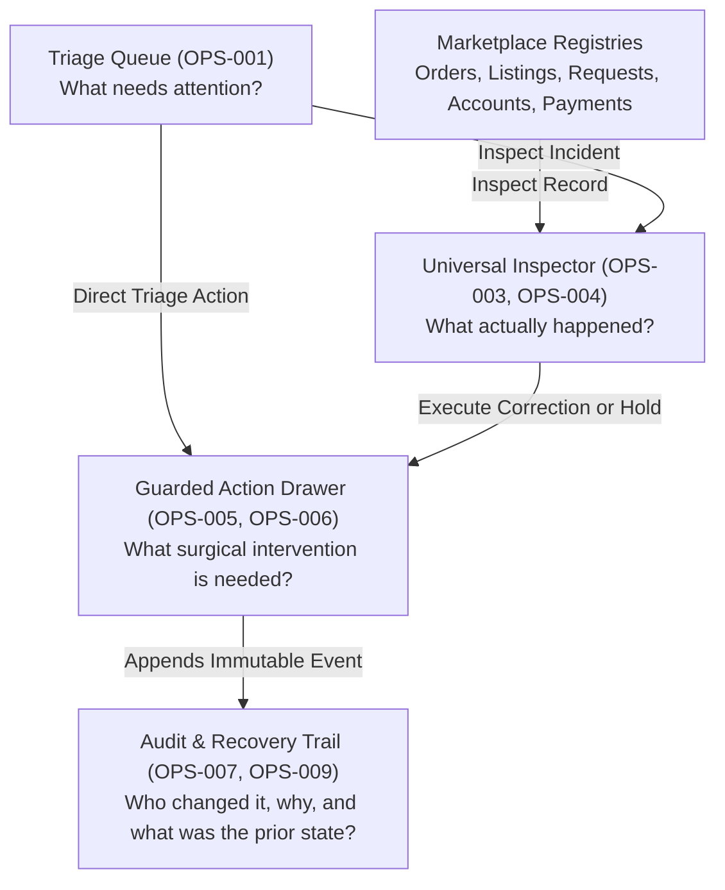
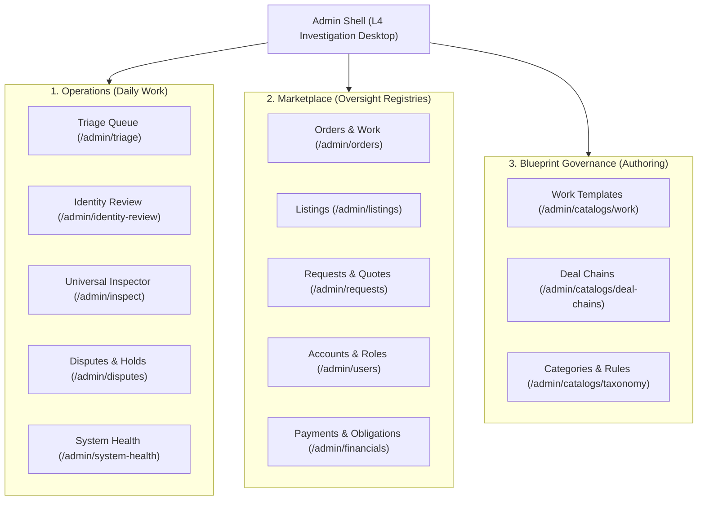
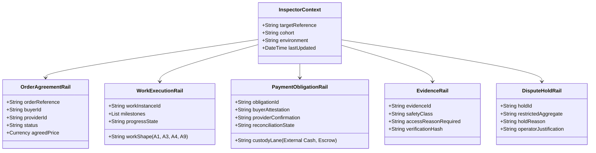

# Admin Operations Restructure — Architecture Diagrams

## 1. The Operational Spine

```mermaid
flowchart TD
    Queue["Triage Queue (OPS-001)\nWhat needs attention?"]
    Inspector["Universal Inspector (OPS-003, OPS-004)\nWhat actually happened?"]
    GuardedAction["Guarded Action Drawer (OPS-005, OPS-006)\nWhat surgical intervention is needed?"]
    Audit["Audit & Recovery Trail (OPS-007, OPS-009)\nWho changed it, why, and what was the prior state?"]

    Registries["Marketplace Registries\nOrders, Listings, Requests, Accounts, Payments"] -->|"Inspect Record"| Inspector
    Queue -->|"Inspect Incident"| Inspector
    Queue -->|"Direct Triage Action"| GuardedAction
    Inspector -->|"Execute Correction or Hold"| GuardedAction
    GuardedAction -->|"Appends Immutable Event"| Audit
```

---

## 2. Navigation Domain Hierarchy

```mermaid
graph TD
    AdminShell["Admin Shell (L4 Investigation Desktop)"]
    
    subgraph Operations ["1. Operations (Daily Work)"]
        Triage["Triage Queue (/admin/triage)"]
        Identity["Identity Review (/admin/identity-review)"]
        UniversalInspect["Universal Inspector (/admin/inspect)"]
        Disputes["Disputes & Holds (/admin/disputes)"]
        Health["System Health (/admin/system-health)"]
    end

    subgraph Marketplace ["2. Marketplace (Oversight Registries)"]
        Orders["Orders & Work (/admin/orders)"]
        Listings["Listings (/admin/listings)"]
        Requests["Requests & Quotes (/admin/requests)"]
        Accounts["Accounts & Roles (/admin/users)"]
        Payments["Payments & Obligations (/admin/financials)"]
    end

    subgraph Blueprints ["3. Blueprint Governance (Authoring)"]
        WorkCatalog["Work Templates (/admin/catalogs/work)"]
        DealChains["Deal Chains (/admin/catalogs/deal-chains)"]
        Taxonomy["Categories & Rules (/admin/catalogs/taxonomy)"]
    end

    AdminShell --> Operations
    AdminShell --> Marketplace
    AdminShell --> Blueprints
```

---

## 3. Separation of Aggregates in Universal Inspector

```mermaid
classDiagram
    class InspectorContext {
        +String targetReference
        +String cohort
        +String environment
        +DateTime lastUpdated
    }

    class OrderAgreementRail {
        +String orderReference
        +String buyerId
        +String providerId
        +String status
        +Currency agreedPrice
    }

    class WorkExecutionRail {
        +String workInstanceId
        +String workShape (A1, A3, A4, A9)
        +List milestones
        +String progressState
    }

    class PaymentObligationRail {
        +String obligationId
        +String custodyLane (External Cash, Escrow)
        +String buyerAttestation
        +String providerConfirmation
        +String reconciliationState
    }

    class EvidenceRail {
        +String evidenceId
        +String safetyClass
        +String accessReasonRequired
        +String verificationHash
    }

    class DisputeHoldRail {
        +String holdId
        +String restrictedAggregate
        +String holdReason
        +String operatorJustification
    }

    InspectorContext --> OrderAgreementRail
    InspectorContext --> WorkExecutionRail
    InspectorContext --> PaymentObligationRail
    InspectorContext --> EvidenceRail
    InspectorContext --> DisputeHoldRail
```
