# Serbizyu 2.0 — Schema Implementation and Canonical ERD Contract

Status: CANONICAL SCHEMA IMPLEMENTATION CONTRACT — founder-approved 2026-07-31
Depends on: `canonical-schema-rebuilt.md`, `domain-state-contracts-rebuilt.md`, `adr-catalog-rebuilt.md`
Scope: implementation preparation and disposable migration rehearsal; no production migration authorization.

## 1. Decisions closing P0-03

### D-SCHEMA-01 — Identifier strategy

- Every canonical table uses `id UUID PRIMARY KEY`.
- UUIDs are generated by the application with UUIDv7 semantics using the pinned PHP UID implementation selected in the runtime baseline.
- PostgreSQL stores the value in native `uuid` format.
- No database-side random UUID default is used for domain aggregates; the application must generate the ID before persistence so commands, audit events, outbox records, and correlation IDs share explicit causality.
- Public URLs may use the aggregate UUID only through authorized route policies; no sequential numeric identifier is exposed.
- Foreign keys use the same native `uuid` type.
- `correlation_id UUID NOT NULL` is required for cross-aggregate commands/events.

Review trigger: revisit only if measured index/write performance or a provider contract requires another identifier strategy. Any change requires an ADR and a new migration baseline decision.

### D-SCHEMA-02 — State representation

- Lifecycle columns use `TEXT NOT NULL` plus named PostgreSQL `CHECK` constraints generated from the canonical domain-state contract.
- PostgreSQL enum types are not used for business lifecycle states because state evolution must be migration-reviewable without type mutation and must remain synchronized with the domain contract.
- Every state-bearing aggregate also has an append-only transition/event history table or an applicable shared event table.
- A migration may not introduce a state value absent from `domain-state-contracts-rebuilt.md`.
- State transitions are enforced in application command handlers and verified by database invariants where cross-row safety requires it.

### D-SCHEMA-03 — Time and money

- All timestamps use `TIMESTAMPTZ NOT NULL` and are written in UTC.
- Money uses `BIGINT amount_minor NOT NULL CHECK (amount_minor >= 0)` plus `CHAR(3) currency NOT NULL`.
- Signed financial effects use separate debit/credit lines or explicit direction fields; no floating-point money is permitted.
- Fee, subsidy, processor-cost, refund, payout, and policy values are immutable snapshots on the applicable obligation/transaction record.

### D-SCHEMA-04 — Financial posting and balance

- `financial_transactions` are created in `draft` status and cannot be marked `posted` by direct row update.
- A single database procedure `post_financial_transaction(transaction_id, expected_version)` locks the transaction, validates that it is draft, validates that all lines use the same currency, validates `SUM(debits) = SUM(credits)`, validates account eligibility, writes `posted_at`, and changes status atomically.
- `financial_entries` are append-only after posting. Corrections use `financial_adjustments` and new linked transactions; no posted line is updated or deleted.
- A unique constraint prevents a transaction from being posted twice.
- Reconciliation compares source payment events/obligations to posted transactions and emits an operational discrepancy; it does not silently repair history.

### D-SCHEMA-05 — JSONB and versioning

- JSONB is permitted only for bounded extension payloads, archetype `structure`, provider payloads, and evidence metadata identified in the canonical schema.
- Every JSONB business payload has `payload_version INTEGER NOT NULL` and an application validator selected by type/version.
- Query-critical fields are first-class columns with indexes; JSONB is not used to hide required relational constraints.

### D-SCHEMA-06 — Foreign keys and deletion

- Financial, evidence, audit, transition, provider-event, and dispute history use `ON DELETE RESTRICT`.
- User-facing content uses explicit archive/status behavior rather than destructive deletion when referenced by history.
- Nullable actor references use `ON DELETE SET NULL` only when the audit contract allows anonymization.
- Sensitive evidence deletion is blocked by active `retention_holds` and produces an audit event when legally permitted.

### D-SCHEMA-07 — Idempotency and provider events

- `idempotency_keys` has a unique `(scope, key)` constraint and stores request hash, response reference, actor, and expiry.
- `provider_events` has a unique `(provider, provider_event_id)` constraint and a processing state.
- Duplicate or out-of-order provider events are safe no-ops or recorded transitions; they cannot create duplicate financial effects.
- Webhook/provider event handling uses an inbox transaction followed by an outbox/domain command boundary.

### D-SCHEMA-08 — Index and constraint policy

- Every index in the canonical schema is named in the migration manifest.
- Partial indexes are used for active/pending operational queries where appropriate.
- Unique constraints are database-enforced, not comment-enforced.
- Migration CI compares the live disposable catalog against the manifest and fails on missing/extra required constraints or indexes.

## 2. Canonical 58-table inventory

The implementation target is the observed 47-table migrated baseline plus eleven founder-approved initiative additions. The total planning inventory is **58 tables**; this remains planning authority, not migration/catalog proof.

### Identity and authorization

`users`, `auth_otps`, `user_profiles`, `role_assignments`, `identity_verifications`, `evidence_files`, `consent_grants`

### Product contract

`categories`, `category_versions`, `capability_profiles`, `listings`, `listing_versions`, `listing_capacity`, `listing_capacity_reservations`, `requests`, `quotes`, `policy_versions`

### Order and Work

`orders`, `order_parties`, `order_terms_snapshots`, `work_instances`, `work_events`

### Payment and accounting

`payment_obligations`, `payment_events`, `financial_accounts`, `financial_transactions`, `financial_entries`, `provider_events`, `financial_adjustments`

### Trust and support

`disputes`, `dispute_events`, `administrative_holds`, `support_cases`, `safety_incidents`, `reviews`

### Communication and measurement

`conversations`, `messages`, `notifications`, `notification_deliveries`, `cohort_classifications`

### Integrity and operations

`audit_events`, `outbox_messages`, `inbox_messages`, `idempotency_keys`, `retention_holds`, `migration_checkpoints`, `capability_activations`, `command_approvals`

### Deal coordination

`deal_chains`, `deal_needs`, `deal_dependencies`, `deal_invitations`

### Owner-scoped integrations

`integration_clients`, `integration_credentials`, `integration_object_mappings`, `integration_webhook_subscriptions`, `integration_webhook_deliveries`, `integration_sync_cursors`

Count: 58 tables (47 observed migrated baseline + eleven approved additions).

Foundation rules:

- Every new entity uses application-generated UUIDv7/native UUID and UTC timestamps; operation-spanning records carry `correlation_id`. Every mutable aggregate uses optimistic `row_version`; immutable business/contract/payload/event versions use explicit semantic names and never share that counter.
- DealChain is a coordination aggregate only. Parent progress/cost is derived; no parent Payment Obligation, wallet, escrow, pooled balance, automatic split, or parent-wide liability exists.
- DealNeed is one ordered service/product slot. Requests/Quotes reuse the existing workflows; a Need may have many of them and at most one active non-cancelled/non-closed child Order.
- DealDependency uses same-chain composite FKs, rejects self-edges, enforces active-edge uniqueness, and rejects cycles through a locked command transaction plus database reachability/constraint-trigger enforcement.
- DealInvitation targets one Need, has explicit scope/expiry/response/actor/revocation and `row_version`, and uses shared idempotency/audit/outbox records. Acceptance does not itself create an Order.
- Existing `requests`, `quotes`, and `orders` receive nullable `(deal_chain_id, deal_need_id)` lineage pairs with all-or-none checks and composite FKs. Child Orders use `origin = 'deal_chain'` and retain ordinary Order/Work/Payment/Evidence/Dispute boundaries.
- Replacement creates new Need/Order history and preserves prior records; it never rewrites or deletes child history. Pilot visibility remains separately gated.

## 3. Migration manifest

Migration files use monotonically ordered batches plus stable names. Each batch records a checksum in `migration_checkpoints`.

| Batch | Contents | Gate |
|---|---|---|
| 000 | PostgreSQL extensions; UUID/UTC, currency, audit/version conventions; `migration_checkpoints` | Disposable catalog test |
| 001 | `users`, `auth_otps`, profiles, roles, evidence, identity verification, consent | Identity/privacy/OTP contract test |
| 002 | Governed category versions, capability profiles, policies, listings/versions, capacity/reservations, requests/quotes | Taxonomy/version/capacity contract test |
| 003 | Deal-Chain foundation, same-Chain/Need keys, dependency/invitation integrity, active-edge uniqueness, and cycle trigger | Deal coordination contract test |
| 004 | Orders, parties, exact terms snapshots, Work instances/events, same-Order and child-Order same-Chain/Need lineage, one-active-child-per-Need uniqueness | Order/Work contract test |
| 005 | Payment obligations/events, accounts, transactions/entries, provider events, adjustments | Ledger/lane invariant test |
| 006 | Trust, disputes, holds, support, safety, reviews, conversations, messages, notifications/deliveries | Trust/support/notification test |
| 007 | Cohorts, audit, ordered outbox/inbox, idempotency, retention, client attribution | Integrity/ordering contract test |
| 008 | Six owner-scoped integration tables, capability activations, command approvals, cross-table FKs | Integration/activation/approval contract test |
| 009 | Backfill/cutover, named/partial indexes, checks/triggers, deterministic local/test factories, forward/rollback/restore rehearsal | Full disposable rehearsal |

Rules:

- Batch 009 is not a substitute for application transition guards; it closes database integrity enforcement.
- A failed batch never advances its checkpoint.
- Destructive schema changes require expand/contract sequencing and restore rehearsal.
- No production migration exists until E0-S2 passes and a separate implementation-entry gate approves it.

## 4. Canonical ERD

The diagram is a relationship-level ERD. Column-level definitions remain in `canonical-schema-rebuilt.md`; no relationship may be implemented outside this contract without updating both artifacts.

```mermaid
erDiagram
  users ||--o| user_profiles : has
  users ||--o{ role_assignments : receives
  users ||--o{ identity_verifications : submits
  users ||--o{ evidence_files : owns
  users ||--o{ consent_grants : grants
  users ||--o{ auth_otps : authenticates

  categories ||--o{ category_versions : versions
  category_versions ||--o{ listing_versions : pins
  capability_profiles ||--o{ listing_versions : pins
  users ||--o{ listings : owns
  listings ||--o{ listing_versions : versions
  listing_versions ||--o{ listing_capacity : defines
  listing_capacity ||--o{ listing_capacity_reservations : reserves
  users ||--o{ requests : creates
  requests ||--o{ quotes : receives

  listings ||--o{ orders : source
  requests ||--o{ orders : creates
  quotes ||--o| orders : accepted_as
  orders ||--o{ order_parties : includes
  orders ||--o{ order_terms_snapshots : freezes
  orders ||--o{ work_instances : requires
  work_instances ||--o{ work_events : records

  orders ||--o{ payment_obligations : requires
  payment_obligations ||--o{ payment_events : records
  payment_obligations ||--o{ financial_transactions : posts
  financial_accounts ||--o{ financial_entries : owns
  financial_transactions ||--o{ financial_entries : contains
  payment_events ||--o{ provider_events : reconciles
  financial_transactions ||--o{ financial_adjustments : corrects
  policy_versions ||--o{ payment_obligations : snapshots

  orders ||--o{ disputes : concerns
  work_instances ||--o{ disputes : concerns
  payment_obligations ||--o{ disputes : concerns
  disputes ||--o{ dispute_events : records
  disputes ||--o{ administrative_holds : creates
  orders ||--o{ support_cases : supports
  work_instances ||--o{ safety_incidents : reports
  orders ||--o{ reviews : receives

  users ||--o{ conversations : participates
  orders ||--o{ conversations : contextualizes
  conversations ||--o{ messages : contains
  users ||--o{ notifications : receives
  notifications ||--o{ notification_deliveries : attempts
  users ||--o{ cohort_classifications : classifies

  users ||--o{ audit_events : acts
  orders ||--o{ audit_events : audits
  payment_obligations ||--o{ audit_events : audits
  audit_events ||--o{ outbox_messages : emits
  idempotency_keys ||--o{ audit_events : explains
  evidence_files ||--o{ retention_holds : protects
  migration_checkpoints ||--o{ audit_events : records
  outbox_messages ||--o{ inbox_messages : consumed_as
  capability_activations ||--o{ command_approvals : evidenced_by
  evidence_files ||--o{ command_approvals : supports

  users ||--o{ integration_clients : owns
  integration_clients ||--o{ integration_credentials : authenticates
  integration_clients ||--o{ integration_object_mappings : maps
  integration_clients ||--o{ integration_webhook_subscriptions : subscribes
  integration_webhook_subscriptions ||--o{ integration_webhook_deliveries : attempts
  outbox_messages ||--o{ integration_webhook_deliveries : delivers
  integration_clients ||--o{ integration_sync_cursors : consumes

  users ||--o{ deal_chains : coordinates
  deal_chains ||--o{ deal_needs : contains
  deal_needs ||--o{ deal_dependencies : predecessor
  deal_needs ||--o{ deal_dependencies : successor
  deal_needs ||--o{ deal_invitations : receives
  deal_needs ||--o{ requests : sources
  deal_needs ||--o{ quotes : sources
  deal_needs ||--o{ orders : forms
```

## 5. Required verification before implementation entry

E0-S2 cannot be marked complete until all of the following are real tool outputs:

1. PostgreSQL 16 disposable database created.
2. Batch 000–009 migrations run from empty state and from the observed 47-table baseline.
3. Catalog comparison reports exactly 58 required application tables.
4. Constraint/index comparison passes, including version, capacity, lineage, ordered inbox, owner/client, activation, and exact-approval constraints.
5. Invalid status, negative amount/capacity, duplicate provider/inbox/idempotency identity, cross-owner lookup, expired approval, deleted-held evidence, unbalanced ledger, invalid FK, and dependency-cycle tests fail as intended.
6. Backup/restore and rollback rehearsals pass with matching migration checksums.
7. The canonical 58-table ERD renders successfully to SVG and is reviewed against the manifest.
8. This implementation contract, canonical schema, domain/state contract, ADR catalog, architecture spine, epics, and the E0-S2 LLD/OpenSpec remain synchronized.

No production migration, live payment, sensitive-ID upload, or deployment may be inferred from a successful disposable rehearsal.

## 6. Change control

Any future change to identifier type, state representation, money precision, ledger posting, deletion policy, FK behavior, JSONB contract, or migration order requires:

- A new ADR or revision to an existing ADR.
- A patch to this contract and `canonical-schema-rebuilt.md`.
- A regenerated ERD if relationships change.
- A migration impact note and rollback/restore rehearsal plan.
- Revalidation of affected story packs and readiness gates.
